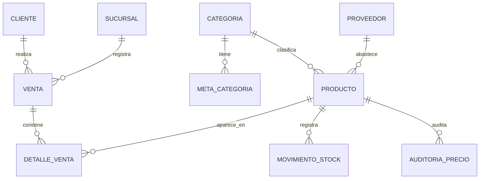
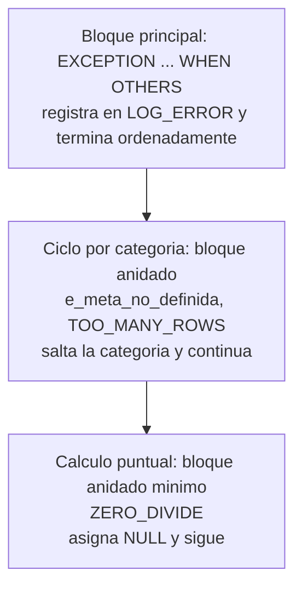
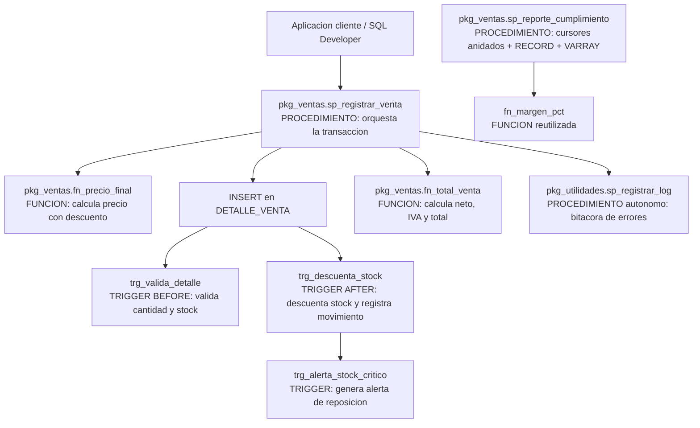

# Evaluación Parcial N° 1 — Caso de Análisis Semestral

**Asignatura:** BDY1103 — Taller de Base de Datos
**Institución:** Duoc UC — Ingeniería en Informática
**Caso:** TecnoParts SpA — Tienda de computadores y componentes
**Equipo:** *(integrante 1)*, *(integrante 2)*, *(integrante 3)*
**Docente:** *(nombre del docente)*
**Fecha:** *(fecha de entrega)*

> **Nota de uso:** los campos entre paréntesis son marcadores para completar. El caso de negocio está planteado sobre una tienda de PCs y componentes; si luego se cambia el rubro, la estructura del informe y los objetos PL/SQL se mantienen y solo cambian nombres de tablas, atributos y reglas de negocio.

---

## Índice

1. Introducción
2. Contexto de negocio, datos a procesar e información a generar
3. Tipos de datos compuestos (RECORD y VARRAY)
4. Desarrollo de bloques PL/SQL con cursores explícitos complejos
5. Integración de control de excepciones
6. Evaluación de Procedimientos, Funciones, Packages y Triggers
7. Conclusión
8. Anexos

---

## 1. Introducción

### 1.1 Descripción del Proyecto

**TecnoParts SpA** es una tienda chilena de computadores armados y componentes (procesadores, tarjetas gráficas, placas madre, memorias, almacenamiento, fuentes, gabinetes y periféricos) que opera con tres sucursales y un canal de venta online. Hoy la operación registra ventas y stock en una base de datos Oracle, pero **toda la lógica de negocio —validación de stock, cálculo de márgenes, descuentos por tipo de cliente, alertas de reposición y reportes de cumplimiento de metas— vive fuera de la base de datos**, repartida entre planillas Excel y consultas manuales que cada vendedor ejecuta por su cuenta.

Esto genera tres problemas concretos:

1. **Inconsistencia:** dos personas calculan el mismo margen de forma distinta porque cada planilla usa su propia fórmula.
2. **Sobreventa:** se emiten ventas de productos sin stock real, porque la validación depende de que el vendedor recuerde revisarlo.
3. **Reportería lenta:** el reporte mensual de rentabilidad por categoría se arma a mano y demora entre dos y tres días hábiles.

El objetivo del proyecto es **centralizar el procesamiento de datos y la generación de información en la propia base de datos usando PL/SQL**, de modo que las reglas de negocio se definan una sola vez, se ejecuten cerca de los datos y queden disponibles para cualquier aplicación cliente (web, escritorio o reportería).

PL/SQL se utiliza para cumplir ese objetivo mediante:

- **Bloques anónimos** para el procesamiento analítico por lotes (consolidación de ventas, márgenes y cumplimiento de metas).
- **Tipos de datos compuestos (RECORD y VARRAY)** para manejar en memoria la estructura de cada fila de resultado y los arreglos de tamaño fijo (metas trimestrales, top de productos).
- **Cursores explícitos con y sin parámetros**, recorridos en **loops anidados**, para cruzar categorías → productos → movimientos de stock en un solo proceso.
- **Control de excepciones** predefinidas por Oracle y definidas por el usuario, para que un dato inválido no detenga todo el proceso ni deje la información a medio escribir.
- **Procedimientos, funciones, packages y triggers** para encapsular, reutilizar y automatizar esa lógica de forma permanente en la base de datos.

### 1.2 Alcance

**Dentro del alcance:**

| Componente del negocio | Qué se ve afectado o mejorado |
|---|---|
| Gestión de inventario | Descuento automático de stock, registro de movimientos y alerta de stock crítico vía triggers y procedimientos. |
| Proceso de venta | Validación de stock, cálculo de neto/IVA/total y descuentos por tipo de cliente centralizados en un package. |
| Control de precios | Auditoría automática de cambios de precio y bloqueo de precios bajo costo mediante triggers. |
| Reportería de gestión | Reporte consolidado de unidades, venta neta, margen y cumplimiento de metas por categoría, generado en un solo proceso PL/SQL. |
| Integridad de datos | Reglas de negocio (no vender bajo costo, no vender sin stock, cantidades positivas) aplicadas en la base de datos y no solo en la aplicación. |

**Fuera del alcance (en esta primera evaluación parcial):**

- Interfaz de usuario, autenticación y capa web.
- Migración de datos históricos desde las planillas actuales.
- Integración con facturación electrónica del SII y con pasarelas de pago.
- Procesos distribuidos o replicación entre sucursales.

El alcance de esta entrega corresponde a la **primera de las tres partes del caso semestral**: modelo de datos, tipos compuestos, bloques anónimos con cursores complejos, control de excepciones y la **evaluación y estrategia de implementación** de procedimientos, funciones, packages y triggers.

### 1.3 Tecnologías Utilizadas

| Tecnología | Versión / detalle | Uso en el proyecto |
|---|---|---|
| Oracle Database | 19c / 21c XE (Express Edition) | Motor de base de datos relacional donde reside el esquema y todo el código PL/SQL. |
| PL/SQL | Nativo del motor Oracle | Lenguaje procedural para bloques anónimos, procedimientos, funciones, packages y triggers. |
| SQL*Plus | Cliente de línea de comandos | Ejecución de scripts DDL/DML y de bloques anónimos con `SET SERVEROUTPUT ON`. |
| Oracle SQL Developer | 23.x | Desarrollo, depuración y compilación de objetos almacenados. |
| SQL Developer Data Modeler | 23.x | Construcción del modelo entidad-relación y modelo relacional. |
| DBMS_OUTPUT | Package nativo de Oracle | Salida en consola de los reportes generados por los bloques anónimos. |
| Git / GitHub | — | Versionamiento de los scripts `.sql` del proyecto. |

---

## 2. Contexto de negocio, datos a procesar e información a generar

### 2.1 Contexto de negocio

TecnoParts SpA vende dos tipos de ítems: **componentes sueltos** y **PCs armados**. Su operación tiene tres características que condicionan el diseño de la solución:

- **Rotación muy desigual:** una tarjeta gráfica de alto valor puede vender 3 unidades al mes con margen de 18%, mientras un cable HDMI vende 400 unidades con margen de 60%. Evaluar rentabilidad solo por unidades vendidas o solo por monto lleva a decisiones equivocadas, por lo que el reporte debe combinar **unidades, venta neta y margen porcentual**.
- **Metas comerciales por categoría y por trimestre:** la gerencia define cuatro metas anuales por categoría (una por trimestre). El sistema debe comparar la venta real del trimestre en curso contra la meta correspondiente.
- **Stock crítico:** cada producto tiene un stock mínimo bajo el cual debe generarse una alerta de reposición al proveedor. Quedarse sin stock de un componente clave detiene el armado de PCs completos.

### 2.2 Modelo de datos



Tablas principales del esquema (DDL completo en el **Anexo A**):

| Tabla | Rol en el proceso |
|---|---|
| `CATEGORIA` | Agrupa productos (GPU, CPU, RAM, etc.). Nivel externo del recorrido. |
| `PRODUCTO` | Catálogo con precio de venta, costo unitario, stock actual y stock crítico. |
| `PROVEEDOR` | Origen de abastecimiento de cada producto. |
| `CLIENTE` | Cliente final, con `tipo_cliente` (NORMAL, PREFERENTE, EMPRESA) que determina el descuento. |
| `SUCURSAL` | Punto de venta (incluye el canal ONLINE). |
| `VENTA` | Cabecera de la venta: cliente, sucursal, fecha, totales y estado. |
| `DETALLE_VENTA` | Líneas de la venta: producto, cantidad, precio unitario y descuento aplicado. |
| `MOVIMIENTO_STOCK` | Bitácora de entradas y salidas de inventario. |
| `META_CATEGORIA` | Metas de venta por categoría y año, desglosadas en cuatro trimestres. |
| `AUDITORIA_PRECIO` | Registro automático de cambios de precio de venta. |
| `ALERTA_STOCK` | Alertas de reposición generadas cuando el stock baja del mínimo. |
| `LOG_ERROR` | Bitácora de errores capturados por los manejadores de excepciones. |

### 2.3 Datos a procesar (entrada)

- **Transaccionales:** cabeceras y líneas de venta del período (`VENTA`, `DETALLE_VENTA`), con cantidad, precio unitario y porcentaje de descuento por línea.
- **Maestros:** productos con su costo unitario, precio de venta, stock actual y stock crítico; categorías activas; proveedores; clientes con su tipo.
- **Paramétricos:** metas trimestrales por categoría y año (`META_CATEGORIA`); constante de IVA (19%); tabla de descuentos por tipo de cliente.
- **De inventario:** movimientos de stock por producto (entradas por compra, salidas por venta, ajustes por merma).

### 2.4 Información relevante a generar (salida)

1. **Reporte de rentabilidad y cumplimiento por categoría:** por cada categoría activa, unidades vendidas, venta neta, costo total, margen porcentual, meta del trimestre en curso y porcentaje de cumplimiento.
2. **Top 5 de productos por categoría**, ordenado por venta neta, con su margen individual.
3. **Resumen de movimiento de inventario** por producto (entradas, salidas y ajustes del período).
4. **Listado de productos en stock crítico**, para generar órdenes de reposición al proveedor.
5. **Bitácora de auditoría de precios**, con precio anterior, precio nuevo, usuario de base de datos y fecha.
6. **Bitácora de errores del procesamiento**, que permite reprocesar solo lo que falló.

---

## 3. Tipos de datos compuestos (RECORD y VARRAY)

Un tipo de dato compuesto agrupa varios valores bajo un solo identificador. PL/SQL los necesita porque el código procedural trabaja **fila por fila en memoria**, mientras que SQL trabaja con conjuntos: el tipo compuesto es la estructura que sostiene esa fila —o ese arreglo de valores— mientras el bloque la procesa.

En el proyecto se usan los dos tipos exigidos, cada uno donde su naturaleza corresponde:

### 3.1 RECORD — estructura heterogénea de una fila de resultado

Un `RECORD` agrupa campos de **distinto tipo** bajo un nombre, de forma análoga a una fila de tabla. Se usa cuando el dato que se necesita manejar no existe como una fila de una sola tabla, sino que es el **resultado calculado** de varias.

```sql
-- Estructura del resumen consolidado por categoría.
-- No corresponde a ninguna tabla: mezcla datos maestros con métricas calculadas.
TYPE t_resumen_cat IS RECORD (
    id_categoria   categoria.id_categoria%TYPE,
    nombre         categoria.nombre%TYPE,
    unidades       NUMBER := 0,
    venta_neta     NUMBER := 0,
    costo_total    NUMBER := 0,
    margen_pct     NUMBER := 0,
    meta_trimestre NUMBER := 0,
    cumplim_pct    NUMBER := 0
);

v_resumen  t_resumen_cat;
```

Detalles de diseño aplicados:

- Los campos que provienen de tablas se declaran con **`%TYPE`**, de modo que si mañana `categoria.nombre` pasa de `VARCHAR2(50)` a `VARCHAR2(80)`, el código no requiere modificación ni falla por `VALUE_ERROR`.
- Los campos calculados se **inicializan en 0**, lo que evita arrastrar `NULL` a las operaciones aritméticas del acumulado.
- Para recorrer filas que **sí** corresponden exactamente a una tabla o a un cursor se usa `%ROWTYPE` (`producto%ROWTYPE`, `c_productos%ROWTYPE`), que es un RECORD implícito. El RECORD explícito se reserva para las estructuras que no existen en el modelo relacional.

### 3.2 VARRAY — colección ordenada de tamaño máximo fijo

Un `VARRAY` (varying array) es una colección **densa, ordenada y con límite máximo declarado**, indexada desde 1. Se eligió para dos casos donde la cardinalidad es conocida y fija por definición del negocio:

```sql
-- Metas trimestrales: por definición son exactamente 4 (Q1..Q4).
-- El límite del VARRAY documenta y hace cumplir esa regla de negocio.
TYPE t_metas_trim IS VARRAY(4) OF NUMBER;

-- Top 5 de productos por categoría: el negocio definió "top 5", no "top N".
TYPE t_top_sku IS VARRAY(5) OF VARCHAR2(30);

v_metas    t_metas_trim;
v_top_sku  t_top_sku := t_top_sku();   -- inicializado vacío
```

El índice del VARRAY de metas **tiene significado de negocio**: `v_metas(1)` es el primer trimestre y `v_metas(4)` el cuarto. Esto permite obtener la meta vigente directamente a partir de la fecha:

```sql
v_trimestre := TO_NUMBER(TO_CHAR(SYSDATE, 'Q'));   -- devuelve 1..4
v_resumen.meta_trimestre := v_metas(v_trimestre);
```

**Restricción importante detectada en el desarrollo:** un tipo de colección declarado dentro de un bloque PL/SQL **no es visible para el motor SQL**, por lo que su constructor no puede usarse dentro de una sentencia `SELECT`. La carga se hace en dos pasos —recuperar los valores a variables escalares y luego construir el VARRAY en PL/SQL:

```sql
SELECT meta_q1, meta_q2, meta_q3, meta_q4
  INTO v_q1, v_q2, v_q3, v_q4
  FROM meta_categoria
 WHERE id_categoria = r_cat.id_categoria
   AND anio         = v_anio;

v_metas := t_metas_trim(v_q1, v_q2, v_q3, v_q4);   -- constructor en PL/SQL
```

Si el tipo se necesitara dentro de SQL, habría que declararlo como tipo de esquema (`CREATE OR REPLACE TYPE ... AS VARRAY`), decisión que se evaluará en la siguiente etapa del caso.

### 3.3 Cómo mejoran la eficiencia del procesamiento

| Aspecto | Sin tipos compuestos | Con RECORD y VARRAY |
|---|---|---|
| Variables por fila | 8 variables escalares sueltas por categoría | 1 variable `v_resumen` con 8 campos |
| Paso de parámetros | 8 parámetros por procedimiento | 1 parámetro de tipo RECORD |
| Accesos a la base de datos | 1 `SELECT` por cada meta trimestral (4 viajes por categoría) | 1 `SELECT` que carga las 4 metas y se consultan en memoria |
| Cambio de estructura | Modificar todas las firmas y declaraciones | Modificar solo la definición del tipo |
| Validación de cardinalidad | Depende del programador | El límite `VARRAY(4)` la impone el motor |

El beneficio de eficiencia más relevante es la **reducción de cambios de contexto entre PL/SQL y SQL**: cada sentencia SQL dentro de un bloque implica un cambio de contexto con costo. Cargar las cuatro metas de una categoría en un VARRAY con una sola consulta, en lugar de consultar cuatro veces la misma fila, reduce a la cuarta parte esos viajes en la etapa de parametrización. En una corrida con 12 categorías, esto baja de 48 a 12 consultas solo por concepto de metas.

El segundo beneficio es de **mantenibilidad medible**: el RECORD `t_resumen_cat` se declara una vez y es usado por el bloque anónimo, por el procedimiento de reporte y por el package; un campo nuevo (por ejemplo, `devoluciones`) se agrega en un solo lugar.

---

## 4. Desarrollo de bloques PL/SQL con cursores explícitos complejos

### 4.1 Qué es un cursor explícito y cuándo se utiliza

Un **cursor** es un área de trabajo en memoria que apunta al conjunto de filas devuelto por una consulta y permite recorrerlo fila por fila. Oracle abre un **cursor implícito** en toda sentencia SQL (`SELECT INTO`, `INSERT`, `UPDATE`, `DELETE`) y lo gestiona por su cuenta.

Un **cursor explícito** es el que el programador declara, abre, lee y cierra:

```sql
CURSOR c_categorias IS
    SELECT id_categoria, nombre
      FROM categoria
     WHERE activo = 'S'
     ORDER BY nombre;
```

Se utiliza cuando:

- La consulta devuelve **más de una fila** y cada una debe procesarse individualmente (un `SELECT INTO` con múltiples filas lanza `TOO_MANY_ROWS`).
- Se necesita **control explícito del ciclo**: saber cuántas filas se han leído (`%ROWCOUNT`), detectar el fin del conjunto (`%NOTFOUND`), verificar si está abierto (`%ISOPEN`) o cortar el recorrido bajo una condición.
- Se requiere **recorrer un conjunto dentro de otro** (loops anidados), que es exactamente el caso de este proyecto.
- Se necesita **reutilizar la misma consulta con distintos filtros**, lo que se logra con cursores parametrizados.

En este proyecto se usa el estilo `FOR ... IN cursor LOOP` para los recorridos completos —porque Oracle se encarga del `OPEN`, `FETCH` y `CLOSE`, y declara implícitamente la variable de registro— y el estilo explícito `OPEN / FETCH / CLOSE` cuando se necesita leer un número acotado de filas, como en la construcción del top 5.

### 4.2 Diferencia entre cursores simples y complejos

| | Cursor simple | Cursor complejo |
|---|---|---|
| Consulta | Una tabla, sin agregación | Múltiples tablas con JOIN, funciones de grupo, subconsultas |
| Parámetros | No recibe | Recibe parámetros que filtran dinámicamente |
| Uso | Recorrido lineal e independiente | Anidado dentro del recorrido de otro cursor |
| Resultado | Filas tal cual están almacenadas | Filas derivadas o calculadas |
| Ejemplo en el proyecto | `c_categorias`: lista las categorías activas | `c_productos(p_id_categoria, p_desde, p_hasta)`: agrega ventas por producto de una categoría en un rango de fechas |

La complejidad no está en la sintaxis, sino en la **dependencia**: el cursor complejo de este proyecto no puede ejecutarse aisladamente, porque necesita el `id_categoria` que aporta el cursor externo en cada iteración.

### 4.3 Cursores explícitos con parámetros y loops anidados

Un cursor parametrizado se declara con una lista de parámetros formales que se usan en el `WHERE` de la consulta y se resuelven al momento del `OPEN`:

```sql
CURSOR c_productos (p_id_categoria NUMBER,
                    p_desde        DATE,
                    p_hasta        DATE) IS
    SELECT p.id_producto,
           p.sku,
           p.nombre,
           p.costo_unitario,
           NVL(SUM(d.cantidad), 0) AS unidades,
           NVL(SUM(d.cantidad * d.precio_unitario
                   * (1 - d.descuento_pct / 100)), 0) AS venta_neta,
           NVL(SUM(d.cantidad * p.costo_unitario), 0)  AS costo_total
      FROM producto p
      LEFT JOIN detalle_venta d
             ON d.id_producto = p.id_producto
      LEFT JOIN venta v
             ON v.id_venta     = d.id_venta
            AND v.estado       = 'EMITIDA'
            AND v.fecha_venta BETWEEN p_desde AND p_hasta
     WHERE p.id_categoria = p_id_categoria
       AND p.activo       = 'S'
     GROUP BY p.id_producto, p.sku, p.nombre, p.costo_unitario
     ORDER BY venta_neta DESC;
```

Notas de diseño:

- Los parámetros pueden declararse con valor por defecto (`p_hasta DATE DEFAULT SYSDATE`), lo que permite invocar el cursor con menos argumentos.
- El tipo de los parámetros **no lleva precisión ni tamaño** (`NUMBER`, no `NUMBER(10)`): es una restricción de la declaración de parámetros formales.
- El `LEFT JOIN` mantiene los productos sin ventas en el período, con métricas en 0 gracias a `NVL`. Sin esto, los productos de rotación nula desaparecerían del informe, que es precisamente uno de los datos que la gerencia necesita ver.

**Utilidad en el manejo de bucles anidados.** Sin parámetros, el cursor interno tendría que traer todos los productos de todas las categorías y el código debería descartar por comparación los que no pertenecen a la categoría en curso: se leerían N×M filas para usar M. Con parámetros, cada `OPEN` del cursor interno recupera exactamente el subconjunto que corresponde, y el filtrado lo hace el motor con sus índices en lugar del código PL/SQL.

Estructura de los tres niveles anidados implementados:

```
FOR r_cat IN c_categorias LOOP                       -- Nivel 1: categorías activas
    cargar metas trimestrales en el VARRAY
    FOR r_prod IN c_productos(r_cat.id_categoria,    -- Nivel 2: productos de la categoría
                              v_desde, v_hasta) LOOP
        acumular unidades, venta neta y costo en el RECORD
        FOR r_mov IN c_movimientos(r_prod.id_producto,
                                   v_desde) LOOP     -- Nivel 3: movimientos del producto
            clasificar entradas / salidas / ajustes
        END LOOP;
    END LOOP;
    calcular margen y cumplimiento; imprimir el resumen
END LOOP;
```

Bloque anónimo resumido (versión completa en el **Anexo B**):

```sql
SET SERVEROUTPUT ON SIZE UNLIMITED;
DECLARE
    TYPE t_metas_trim   IS VARRAY(4) OF NUMBER;
    TYPE t_top_sku      IS VARRAY(5) OF VARCHAR2(30);

    TYPE t_resumen_cat IS RECORD (
        id_categoria   categoria.id_categoria%TYPE,
        nombre         categoria.nombre%TYPE,
        unidades       NUMBER := 0,
        venta_neta     NUMBER := 0,
        costo_total    NUMBER := 0,
        margen_pct     NUMBER := 0,
        meta_trimestre NUMBER := 0,
        cumplim_pct    NUMBER := 0
    );

    v_resumen    t_resumen_cat;
    v_metas      t_metas_trim;
    v_top        t_top_sku := t_top_sku();
    v_anio       NUMBER := TO_NUMBER(TO_CHAR(SYSDATE, 'YYYY'));
    v_trimestre  NUMBER := TO_NUMBER(TO_CHAR(SYSDATE, 'Q'));
    v_desde      DATE   := TRUNC(SYSDATE, 'Q');
    v_hasta      DATE   := SYSDATE;
    v_q1 NUMBER; v_q2 NUMBER; v_q3 NUMBER; v_q4 NUMBER;
    v_entradas   NUMBER;
    v_salidas    NUMBER;

    e_meta_no_definida EXCEPTION;

    CURSOR c_categorias IS
        SELECT id_categoria, nombre
          FROM categoria
         WHERE activo = 'S'
         ORDER BY nombre;

    CURSOR c_productos (p_id_categoria NUMBER, p_desde DATE, p_hasta DATE) IS
        SELECT /* ... ver 4.3 ... */ p.id_producto, p.sku, p.nombre,
               NVL(SUM(d.cantidad),0) AS unidades,
               NVL(SUM(d.cantidad * d.precio_unitario
                       * (1 - d.descuento_pct/100)),0) AS venta_neta,
               NVL(SUM(d.cantidad * p.costo_unitario),0) AS costo_total
          FROM producto p
          LEFT JOIN detalle_venta d ON d.id_producto = p.id_producto
          LEFT JOIN venta v ON v.id_venta = d.id_venta
                           AND v.estado = 'EMITIDA'
                           AND v.fecha_venta BETWEEN p_desde AND p_hasta
         WHERE p.id_categoria = p_id_categoria
           AND p.activo = 'S'
         GROUP BY p.id_producto, p.sku, p.nombre, p.costo_unitario
         ORDER BY venta_neta DESC;

    CURSOR c_movimientos (p_id_producto NUMBER, p_desde DATE) IS
        SELECT tipo_movimiento, SUM(cantidad) AS total
          FROM movimiento_stock
         WHERE id_producto = p_id_producto
           AND fecha      >= p_desde
         GROUP BY tipo_movimiento;
BEGIN
    FOR r_cat IN c_categorias LOOP
        -- reinicio del acumulador por cada categoría
        v_resumen := NULL;
        v_resumen.id_categoria := r_cat.id_categoria;
        v_resumen.nombre       := r_cat.nombre;
        v_resumen.unidades     := 0;
        v_resumen.venta_neta   := 0;
        v_resumen.costo_total  := 0;
        v_top := t_top_sku();

        -- Carga de metas trimestrales en el VARRAY
        BEGIN
            SELECT meta_q1, meta_q2, meta_q3, meta_q4
              INTO v_q1, v_q2, v_q3, v_q4
              FROM meta_categoria
             WHERE id_categoria = r_cat.id_categoria
               AND anio         = v_anio;

            v_metas := t_metas_trim(v_q1, v_q2, v_q3, v_q4);
            v_resumen.meta_trimestre := v_metas(v_trimestre);
        EXCEPTION
            WHEN NO_DATA_FOUND THEN
                RAISE e_meta_no_definida;
        END;

        -- Nivel 2: productos de la categoría
        FOR r_prod IN c_productos(r_cat.id_categoria, v_desde, v_hasta) LOOP
            v_resumen.unidades    := v_resumen.unidades    + r_prod.unidades;
            v_resumen.venta_neta  := v_resumen.venta_neta  + r_prod.venta_neta;
            v_resumen.costo_total := v_resumen.costo_total + r_prod.costo_total;

            -- Top 5 por venta neta: el cursor ya viene ordenado
            IF v_top.COUNT < v_top.LIMIT AND r_prod.unidades > 0 THEN
                v_top.EXTEND;
                v_top(v_top.COUNT) := r_prod.sku;
            END IF;

            -- Nivel 3: movimientos de inventario del producto
            v_entradas := 0;
            v_salidas  := 0;
            FOR r_mov IN c_movimientos(r_prod.id_producto, v_desde) LOOP
                CASE r_mov.tipo_movimiento
                    WHEN 'ENTRADA' THEN v_entradas := v_entradas + r_mov.total;
                    WHEN 'SALIDA'  THEN v_salidas  := v_salidas  + r_mov.total;
                    ELSE NULL;
                END CASE;
            END LOOP;

            DBMS_OUTPUT.PUT_LINE('   ' || RPAD(r_prod.sku, 14)
                || RPAD(SUBSTR(r_prod.nombre,1,28), 30)
                || LPAD(r_prod.unidades, 6)
                || LPAD(TO_CHAR(r_prod.venta_neta, '999G999G999'), 14)
                || '   E:' || v_entradas || ' S:' || v_salidas);
        END LOOP;

        -- Métricas de cierre de la categoría
        v_resumen.margen_pct  := ROUND((v_resumen.venta_neta - v_resumen.costo_total)
                                       / v_resumen.venta_neta * 100, 2);
        v_resumen.cumplim_pct := ROUND(v_resumen.venta_neta
                                       / v_resumen.meta_trimestre * 100, 2);

        DBMS_OUTPUT.PUT_LINE('TOTAL ' || v_resumen.nombre
            || ' | Unid: '       || v_resumen.unidades
            || ' | Neto: '       || TO_CHAR(v_resumen.venta_neta, '999G999G999')
            || ' | Margen: '     || v_resumen.margen_pct || '%'
            || ' | Cumplim.: '   || v_resumen.cumplim_pct || '%');
    END LOOP;
EXCEPTION
    /* manejadores: ver sección 5 */
    WHEN OTHERS THEN
        DBMS_OUTPUT.PUT_LINE('Error no previsto: ' || SQLERRM);
END;
/
```

### 4.4 Problemas específicos que resuelven los cursores complejos en el proyecto

| Problema del negocio | Cómo lo resuelve el cursor complejo |
|---|---|
| El margen por categoría se calculaba a mano y con criterios distintos | `c_productos` agrega venta neta y costo con la misma fórmula para todas las categorías, en una sola pasada |
| Los productos sin ventas desaparecían de los informes Excel | El `LEFT JOIN` del cursor los conserva con métricas en 0, haciendo visible la rotación nula |
| No se sabía si la venta de una categoría venía de un producto estrella o de venta pareja | El cursor viene ordenado por venta neta, lo que permite construir el top 5 sin una segunda consulta |
| Descuadres entre stock registrado y movimientos | `c_movimientos`, anidado por producto, contrasta entradas y salidas contra el stock actual |
| El reporte debía volver a filtrarse por fecha cada vez | Los parámetros `p_desde` y `p_hasta` permiten reusar el mismo cursor para el trimestre, el mes o cualquier rango |

### 4.5 Ventajas para volúmenes grandes y múltiples fuentes

- **La agregación ocurre en el motor, no en el código.** `SUM` y `GROUP BY` dentro del cursor hacen que PL/SQL reciba una fila por producto en lugar de una por línea de venta. Con 50.000 líneas de detalle y 600 productos, el ciclo itera 600 veces en lugar de 50.000.
- **Filtrado en el origen mediante parámetros.** El cursor interno recupera solo las filas de la categoría en curso, aprovechando el índice sobre `producto.id_categoria`, en lugar de traer todo el catálogo y descartar en memoria.
- **Consolidación de múltiples fuentes en una estructura única.** Un solo cursor cruza `producto`, `detalle_venta` y `venta`; la aplicación cliente no necesita conocer esas tres tablas ni cómo se relacionan.
- **Consumo de memoria acotado y predecible.** El cursor mantiene abierto un conjunto de resultados y entrega las filas de a poco, en lugar de cargar toda la información en colecciones en memoria: el consumo no crece linealmente con el volumen de datos.
- **Procesamiento incremental y resiliente.** Como cada iteración es independiente, un error en una categoría puede registrarse en `LOG_ERROR` y continuar con la siguiente, en lugar de abortar el informe completo.

**Contrapartida reconocida:** el recorrido fila por fila implica un cambio de contexto entre PL/SQL y SQL por cada `FETCH`. Para volúmenes de orden millones de filas, lo correcto es `BULK COLLECT ... LIMIT` con `FORALL`, lo que se plantea como recomendación en la sección 7.3.

---

## 5. Integración de control de excepciones

### 5.1 Excepciones predefinidas por Oracle

Son excepciones con **nombre y número de error ya declarados** por el motor en el package `STANDARD`. Se levantan automáticamente cuando ocurre la condición de error y se capturan por su nombre, sin declaración previa.

| Excepción | Código | Cuándo se produce en este proyecto |
|---|---|---|
| `NO_DATA_FOUND` | ORA-01403 | Un `SELECT INTO` no encuentra la meta anual de una categoría, o se consulta un producto inexistente |
| `TOO_MANY_ROWS` | ORA-01422 | Un `SELECT INTO` sobre `meta_categoria` devuelve más de una fila por datos duplicados de carga |
| `ZERO_DIVIDE` | ORA-01476 | Cálculo de margen cuando la venta neta del período es 0, o de cumplimiento cuando la meta es 0 |
| `DUP_VAL_ON_INDEX` | ORA-00001 | Inserción de un SKU de producto ya existente (índice único) |
| `VALUE_ERROR` | ORA-06502 | Un valor excede la precisión de la variable destino, o falla una conversión numérica |
| `SUBSCRIPT_BEYOND_COUNT` | ORA-06533 | Se accede a `v_metas(3)` cuando el VARRAY solo tiene 2 elementos cargados |
| `SUBSCRIPT_OUTSIDE_LIMIT` | ORA-06532 | Se intenta `EXTEND` más allá del límite declarado `VARRAY(5)` del top de productos |
| `COLLECTION_IS_NULL` | ORA-06531 | Se opera sobre el VARRAY antes de inicializarlo con su constructor |
| `CURSOR_ALREADY_OPEN` | ORA-06511 | `OPEN` sobre un cursor explícito que no fue cerrado en una iteración previa |

**Cuándo corresponde usarlas:** cuando el error es una **condición técnica reconocida por el motor**. No requieren declararse y su nombre documenta por sí mismo qué ocurrió.

Ejemplo aplicado al cálculo de márgenes:

```sql
BEGIN
    v_resumen.margen_pct := ROUND((v_resumen.venta_neta - v_resumen.costo_total)
                                   / v_resumen.venta_neta * 100, 2);
EXCEPTION
    WHEN ZERO_DIVIDE THEN
        -- Sin ventas en el período: el margen no es 0, es "no aplicable"
        v_resumen.margen_pct := NULL;
        DBMS_OUTPUT.PUT_LINE('AVISO: ' || v_resumen.nombre
                             || ' sin ventas en el período.');
END;
```

Detalle no trivial: la división por cero se maneja en un **bloque anidado** dentro del ciclo. Si el manejador estuviera solo en la sección `EXCEPTION` del bloque principal, la primera categoría sin ventas abortaría el recorrido completo y las categorías siguientes nunca se procesarían. **El alcance del manejador define hasta dónde se propaga el daño de un error.**

### 5.2 Excepciones definidas por el usuario

Son excepciones que el desarrollador declara para representar **violaciones de reglas de negocio**, situaciones que el motor considera perfectamente válidas pero que la empresa no acepta. Existen dos mecanismos:

**a) Declaración y `RAISE` explícito** — para uso interno del bloque o del package:

```sql
DECLARE
    e_meta_no_definida  EXCEPTION;
    e_stock_insuficiente EXCEPTION;
    e_precio_bajo_costo  EXCEPTION;
BEGIN
    IF v_stock_actual < p_cantidad THEN
        RAISE e_stock_insuficiente;
    END IF;
    ...
EXCEPTION
    WHEN e_stock_insuficiente THEN
        registrar_log('VENTA', -20020, 'Stock insuficiente producto '
                                        || p_id_producto);
        RAISE;   -- se re-lanza para que el llamador decida
END;
```

**b) `RAISE_APPLICATION_ERROR`** — para comunicar el error a la aplicación cliente con un número en el rango reservado **-20000 a -20999** y un mensaje de negocio:

```sql
IF :NEW.precio_venta < :NEW.costo_unitario THEN
    RAISE_APPLICATION_ERROR(-20031,
        'El precio de venta ($' || :NEW.precio_venta ||
        ') no puede ser inferior al costo ($' || :NEW.costo_unitario || ').');
END IF;
```

**c) `PRAGMA EXCEPTION_INIT`** — asocia un nombre a un código de error, ya sea uno de Oracle sin nombre predefinido o uno propio del rango de aplicación, para que el cliente lo capture por nombre:

```sql
-- Error de Oracle sin nombre predefinido
e_padre_con_hijos EXCEPTION;
PRAGMA EXCEPTION_INIT(e_padre_con_hijos, -2292);  -- ORA-02292: FK child record found

-- Excepción propia del negocio, publicada en la especificación del package
e_stock_insuficiente EXCEPTION;
PRAGMA EXCEPTION_INIT(e_stock_insuficiente, -20020);
```

**Criterio de decisión aplicado en el proyecto:**

| Situación | Tipo de excepción | Razón |
|---|---|---|
| No existe la fila consultada | Predefinida (`NO_DATA_FOUND`) | Condición técnica que el motor ya detecta y nombra |
| Meta anual no cargada para la categoría | Definida por el usuario (`e_meta_no_definida`) | Técnicamente es `NO_DATA_FOUND`, pero el negocio necesita distinguir "no hay datos" de "falta un parámetro de gestión" |
| Stock menor que la cantidad solicitada | Definida por el usuario (`-20020`) | El motor no conoce la regla; el dato es válido pero el negocio lo rechaza |
| Precio de venta bajo el costo | Definida por el usuario (`-20031`) | Regla comercial pura |
| División por cero al calcular margen | Predefinida (`ZERO_DIVIDE`) | Error aritmético del motor |
| Cantidad vendida negativa | Predefinida (`VALUE_ERROR`) o restricción `CHECK` | Conviene resolverlo con una constraint antes de llegar a PL/SQL |

Regla práctica adoptada: **si el motor puede detectar la condición, se usa la excepción predefinida; si la condición solo existe porque el negocio lo decidió, se define por el usuario.**

### 5.3 Integración del control de excepciones en los bloques del proyecto

La estrategia es de **tres niveles**, con un principio: capturar el error en el nivel más bajo posible para que el resto del proceso continúe.



1. **Nivel de operación (bloque anidado mínimo):** rodea una sola sentencia riesgosa (una división, un `SELECT INTO`). Asigna un valor por defecto y continúa. Es el nivel que **evita que el ciclo se rompa**.
2. **Nivel de iteración (bloque anidado por categoría):** captura los errores que hacen inviable procesar esa categoría. Registra en `LOG_ERROR`, informa por `DBMS_OUTPUT` y pasa a la siguiente con `CONTINUE`.
3. **Nivel de bloque (sección `EXCEPTION` principal):** red de seguridad con `WHEN OTHERS`. Registra `SQLCODE`, `SQLERRM` y `DBMS_UTILITY.FORMAT_ERROR_BACKTRACE` —que indica la línea exacta del error—, hace `ROLLBACK` si hubo DML pendiente y finaliza de forma controlada.

```sql
    FOR r_cat IN c_categorias LOOP
        BEGIN
            ... procesamiento de la categoría ...
        EXCEPTION
            WHEN e_meta_no_definida THEN
                sp_registrar_log('REPORTE', -20050,
                    'Sin meta ' || v_anio || ' para categoría ' || r_cat.nombre);
                CONTINUE;                      -- siguiente categoría
            WHEN TOO_MANY_ROWS THEN
                sp_registrar_log('REPORTE', SQLCODE,
                    'Metas duplicadas en categoría ' || r_cat.nombre);
                CONTINUE;
            WHEN SUBSCRIPT_BEYOND_COUNT THEN
                sp_registrar_log('REPORTE', SQLCODE,
                    'VARRAY de metas incompleto en ' || r_cat.nombre);
                CONTINUE;
        END;
    END LOOP;
EXCEPTION
    WHEN OTHERS THEN
        ROLLBACK;
        sp_registrar_log('REPORTE', SQLCODE,
            SQLERRM || ' | ' || DBMS_UTILITY.FORMAT_ERROR_BACKTRACE);
        RAISE;
END;
```

Consideraciones aplicadas:

- **`WHEN OTHERS` nunca queda vacío ni silencioso.** Un `WHEN OTHERS THEN NULL` oculta el error y es la causa más frecuente de datos corruptos sin rastro. Siempre se registra y, cuando el llamador debe enterarse, se re-lanza con `RAISE`.
- **`sp_registrar_log` usa `PRAGMA AUTONOMOUS_TRANSACTION`**, de modo que el `COMMIT` del registro de error sobreviva al `ROLLBACK` de la transacción fallida. Sin esto, el rollback borraría también la evidencia del error.
- **Los nombres de excepción propios se publican en la especificación del package**, para que la aplicación cliente los capture por nombre y no comparando strings del mensaje de error.

### 5.4 Cómo previene errores y asegura la integridad de los datos

| Riesgo | Control implementado | Resultado |
|---|---|---|
| Venta emitida sin stock disponible | `e_stock_insuficiente` levantada antes de insertar el detalle | La venta se rechaza completa; el stock nunca queda negativo |
| Stock descontado pero venta no cerrada | `ROLLBACK` en `WHEN OTHERS` del procedimiento de venta | La transacción es atómica: o se aplica todo o nada |
| Producto vendido bajo costo por error de tipeo | `RAISE_APPLICATION_ERROR(-20031)` en el trigger de precio | El `UPDATE` se aborta y el precio original se conserva |
| Reporte mensual abortado por una categoría mal parametrizada | Manejadores por iteración con `CONTINUE` | Se entrega el reporte de las 11 categorías correctas y queda registrada la que falló |
| Error sin rastro para diagnóstico | `LOG_ERROR` autónomo con `SQLCODE`, `SQLERRM` y backtrace | El error es reproducible y ubicable en la línea exacta |
| División por cero propagada al informe | `ZERO_DIVIDE` con asignación de `NULL` | El indicador se informa como "no aplicable" y no como 0%, que sería una conclusión falsa |

El punto de fondo: el control de excepciones en este proyecto no sirve solo para "que no salga error en pantalla", sino para **decidir explícitamente qué pasa con la transacción** cuando algo falla. Sin manejadores, el comportamiento por defecto propaga el error al cliente dejando la transacción abierta y parcialmente aplicada, que es el peor escenario posible para la integridad de los datos.

---

## 6. Evaluación de Procedimientos, Funciones, Packages y Triggers

Esta sección evalúa cada tipo de objeto almacenado, define **qué parte de la solución le corresponde** y por qué, y discute sus limitaciones. El código completo está en el **Anexo C**.

### 6.1 Procedimientos almacenados

Un **procedimiento almacenado** es un subprograma PL/SQL con nombre, compilado y guardado en el diccionario de datos, que ejecuta una serie de acciones. Puede recibir parámetros `IN`, `OUT` e `IN OUT`, **no retorna valor** mediante `RETURN` y por lo tanto **no se invoca dentro de una sentencia SQL**: se llama con `EXECUTE`, desde otro bloque PL/SQL o desde la aplicación.

Se usa para **tareas repetitivas y automatizadas que modifican el estado de la base de datos**. Procedimientos definidos en el proyecto:

| Procedimiento | Responsabilidad | Por qué es procedimiento y no función |
|---|---|---|
| `sp_registrar_venta` | Crea la cabecera, valida stock, inserta detalles, calcula totales y cierra la venta | Ejecuta DML y controla una transacción completa; devuelve el id por parámetro `OUT` |
| `sp_reporte_cumplimiento` | Genera el reporte consolidado por categoría (cursores anidados del punto 4) | Su resultado es un conjunto de líneas de salida, no un valor único |
| `sp_generar_alertas_stock` | Recorre productos bajo stock crítico e inserta en `ALERTA_STOCK` | Acción masiva sobre datos |
| `sp_registrar_log` | Registra errores con `PRAGMA AUTONOMOUS_TRANSACTION` | Debe hacer `COMMIT` independiente de la transacción principal |

### 6.2 Funciones almacenadas

Una **función almacenada** es un subprograma que **obligatoriamente retorna un valor** mediante `RETURN`. Su propósito es **calcular**, no modificar. Si no contiene DML, puede invocarse dentro de sentencias SQL (`SELECT`, `WHERE`, `ORDER BY`), lo que la vuelve especialmente útil para cálculos reutilizables.

| Función | Retorno | Uso |
|---|---|---|
| `fn_margen_pct(p_id_producto)` | `NUMBER` | Margen porcentual de un producto; usada tanto en PL/SQL como en `SELECT` |
| `fn_precio_final(p_id_producto, p_tipo_cliente)` | `NUMBER` | Precio con el descuento correspondiente al tipo de cliente |
| `fn_total_venta(p_id_venta)` | `NUMBER` | Suma de las líneas de la venta, con IVA aplicado |
| `fn_stock_disponible(p_id_producto)` | `NUMBER` | Stock actual menos reservas pendientes |

Ventaja concreta verificable: `fn_margen_pct` puede usarse directamente en una consulta ad hoc, algo imposible con un procedimiento:

```sql
SELECT sku, nombre, fn_margen_pct(id_producto) AS margen
  FROM producto
 WHERE fn_margen_pct(id_producto) < 10
 ORDER BY margen;
```

Esto elimina de raíz el problema original del negocio —cada planilla calculaba el margen de forma distinta—, porque **la fórmula existe en un solo lugar y todos la invocan**.

### 6.3 Packages

Un **package** es una unidad que agrupa procedimientos, funciones, tipos, cursores, constantes, variables y excepciones relacionadas. Se compone de dos partes:

- **Especificación (`PACKAGE`):** la interfaz pública. Declara qué existe y con qué firma, sin implementación.
- **Cuerpo (`PACKAGE BODY`):** la implementación. Todo lo declarado solo aquí es **privado** y no visible desde fuera.

Packages del proyecto:

| Package | Contenido | Modularización que aporta |
|---|---|---|
| `pkg_ventas` | Constante de IVA, tipo `t_resumen_cat`, excepciones de negocio, `sp_registrar_venta`, `fn_total_venta`, `fn_precio_final`, `sp_reporte_cumplimiento` | Todo el dominio "venta" en una unidad; los helpers de cálculo quedan privados |
| `pkg_inventario` | `sp_generar_alertas_stock`, `fn_stock_disponible`, `sp_ajustar_stock`, `sp_registrar_movimiento` | Todo el dominio "inventario", incluida la lógica que invocan los triggers |
| `pkg_utilidades` | `sp_registrar_log`, `fn_formatea_monto` | Servicios transversales reutilizables |

Beneficios de la modularización en packages, evaluados sobre este caso:

- **Encapsulamiento real:** la fórmula de descuento por tipo de cliente es una función privada del cuerpo de `pkg_ventas`. Nadie puede invocarla directamente ni aplicarla de forma distinta; solo se accede a través de `fn_precio_final`.
- **Gestión de dependencias:** si cambia el cuerpo del package sin tocar la especificación, **los objetos dependientes no se invalidan ni requieren recompilación**. Con procedimientos independientes, cualquier cambio invalida la cadena de dependencias.
- **Estado persistente por sesión:** las variables declaradas en la especificación conservan su valor durante toda la sesión, lo que permite cachear parámetros (como el porcentaje de IVA leído de una tabla) en lugar de consultarlos en cada llamada.
- **Sobrecarga (overloading):** se puede tener `fn_precio_final(p_id_producto, p_tipo_cliente)` y `fn_precio_final(p_sku, p_tipo_cliente)` con el mismo nombre y distinta firma, algo imposible entre procedimientos independientes.
- **Orden y navegabilidad:** 14 objetos sueltos en el esquema se convierten en 3 unidades con nombre de dominio.

### 6.4 Triggers

Un **trigger** es un bloque PL/SQL que el motor ejecuta **automáticamente** cuando ocurre un evento determinado: DML (`INSERT`, `UPDATE`, `DELETE`), DDL o de sistema (`LOGON`, `LOGOFF`). No se invoca: se dispara. Se clasifica por momento (`BEFORE`/`AFTER`) y por granularidad (`FOR EACH ROW` a nivel de fila, o de sentencia).

| Trigger | Evento | Función |
|---|---|---|
| `trg_audita_precio` | `BEFORE UPDATE OF precio_venta ON producto FOR EACH ROW` | Valida que el precio no quede bajo costo e inserta el cambio en `AUDITORIA_PRECIO` |
| `trg_descuenta_stock` | `AFTER INSERT ON detalle_venta FOR EACH ROW` | Descuenta stock del producto y registra el movimiento |
| `trg_valida_detalle` | `BEFORE INSERT ON detalle_venta FOR EACH ROW` | Rechaza cantidades ≤ 0 y verifica stock disponible |
| `trg_alerta_stock_critico` | `AFTER UPDATE OF stock_actual ON producto FOR EACH ROW` | Inserta en `ALERTA_STOCK` si el stock cruzó el mínimo |

Automatización de auditoría e integridad que aportan:

- **Auditoría no evitable:** `trg_audita_precio` se dispara aunque el cambio venga de la aplicación web, de SQL Developer o de un script manual. Ninguna ruta de acceso puede saltarse el registro, lo que es exactamente lo que se busca de una auditoría.
- **Integridad de datos más allá de las constraints:** una constraint `CHECK` no puede comparar columnas de tablas distintas. La regla "el precio de venta no puede ser inferior al costo del mismo producto" y "no se puede vender más de lo que hay en stock" requieren un trigger.
- **Consistencia derivada:** `producto.stock_actual` es un dato derivado de los movimientos. El trigger lo mantiene sincronizado sin que la aplicación deba recordar actualizarlo.
- **Trazabilidad con `USER` y `SYSTIMESTAMP`:** el trigger registra quién y cuándo, información que la aplicación podría falsear u omitir.

### 6.5 Estrategia de implementación e interacción entre los objetos

La estrategia asigna a cada tipo de objeto el rol que su naturaleza le permite cumplir mejor:



Flujo de una venta, paso a paso:

1. La aplicación invoca **`pkg_ventas.sp_registrar_venta`** con cliente, sucursal y las líneas de la venta. Es el único punto de entrada: la aplicación **no ejecuta `INSERT` directo** sobre las tablas.
2. El procedimiento consulta **`fn_precio_final`** para obtener el precio con el descuento del tipo de cliente. La función no modifica nada, solo calcula.
3. Al insertar cada línea, **`trg_valida_detalle`** (BEFORE) rechaza cantidades inválidas o sin stock suficiente. Si la regla se viola, la excepción aborta la transacción completa.
4. Insertada la línea, **`trg_descuenta_stock`** (AFTER) descuenta el stock y registra el movimiento en `MOVIMIENTO_STOCK`. Ocurre sin que el procedimiento tenga que pedirlo.
5. El `UPDATE` de stock dispara **`trg_alerta_stock_critico`**, que genera la alerta de reposición si corresponde.
6. El procedimiento calcula los totales con **`fn_total_venta`**, actualiza la cabecera y hace `COMMIT`.
7. Si algo falla, el manejador hace `ROLLBACK` y llama a **`pkg_utilidades.sp_registrar_log`**, que graba el error en transacción autónoma para que sobreviva al rollback.

La contribución a la **solución integral** se puede resumir en una división de responsabilidades: los **procedimientos orquestan y modifican**, las **funciones calculan y se reutilizan**, los **packages agrupan y encapsulan**, y los **triggers garantizan lo que no debe depender de que alguien lo recuerde**.

### 6.6 Reutilización de código y mantenimiento

- **Un cambio, un lugar.** Si el IVA cambia de 19% a otro valor, se modifica la constante `pkg_ventas.c_iva`. Sin esta arquitectura, habría que buscar el número mágico `0.19` en la aplicación web, los reportes y las planillas.
- **La regla de negocio es independiente del cliente.** La aplicación web, un proceso batch nocturno y una consulta manual del jefe de local usan la misma `fn_precio_final` y obtienen el mismo resultado.
- **Compilación temprana de errores.** El código PL/SQL se compila y valida contra el diccionario de datos: si alguien elimina la columna `producto.costo_unitario`, los objetos dependientes quedan inválidos de inmediato, en lugar de fallar en producción a mitad de una venta.
- **Superficie de seguridad reducida.** La aplicación puede tener permiso de `EXECUTE` sobre los packages y ningún permiso de `INSERT`/`UPDATE` sobre las tablas. Toda modificación pasa por lógica validada.

### 6.7 Problemas y limitaciones reconocidos

**Rendimiento**

- El procesamiento fila por fila con cursores anidados implica un cambio de contexto PL/SQL↔SQL por cada `FETCH`. Es aceptable para cientos o miles de filas; para millones se requiere `BULK COLLECT ... LIMIT` con `FORALL`.
- Una función invocada dentro de un `SELECT` que recorre 600.000 filas se ejecuta 600.000 veces. `fn_margen_pct` es cómoda en consultas ad hoc, pero para reportes masivos conviene resolver el cálculo en SQL puro o declarar la función `DETERMINISTIC` para permitir cacheo.
- Los triggers `FOR EACH ROW` se ejecutan una vez por fila afectada: una carga masiva de 50.000 líneas de detalle dispara 50.000 ejecuciones del trigger de stock, lo que convierte una carga de segundos en minutos. Para cargas iniciales se contempla deshabilitar temporalmente los triggers y recalcular el stock por lote.

**Complejidad de mantenimiento**

- **Lógica oculta:** el trigger es el objeto más peligroso desde el punto de vista del mantenimiento, porque **no aparece en el código que lo provoca**. Un desarrollador nuevo que lea `sp_registrar_venta` no verá que el stock se descuenta, porque eso ocurre en un trigger. Mitigación adoptada: documentar los triggers vigentes en este informe y mantener los triggers cortos, delegando la lógica a procedimientos del package.
- **Encadenamiento de triggers:** `trg_descuenta_stock` actualiza `producto`, lo que dispara `trg_alerta_stock_critico`. Estas cadenas son difíciles de depurar y pueden volverse recursivas. Se limita el proyecto a un nivel de encadenamiento.
- **Tabla mutante (ORA-04091):** un trigger `FOR EACH ROW` sobre `detalle_venta` no puede consultar `detalle_venta`. Fue una restricción concreta al validar el total de la venta desde el trigger; la validación se movió al procedimiento, y de necesitarse en el trigger se usaría un **trigger compuesto** (`COMPOUND TRIGGER`).
- **Lógica repartida en dos capas:** parte de las reglas queda en la base de datos y parte en la aplicación. Requiere el acuerdo explícito de que las validaciones de integridad viven en la base de datos y las de interfaz en el cliente.
- **Versionamiento:** el código almacenado en la base de datos no se versiona solo. Se mitiga manteniendo los scripts `.sql` en Git como fuente única de verdad.

**Seguridad**

- Por defecto, los subprogramas se ejecutan con **derechos del definidor** (`AUTHID DEFINER`): quien tiene `EXECUTE` opera con los privilegios del dueño del objeto. Es útil para restringir el acceso directo a tablas, pero un procedimiento mal diseñado se convierte en una escalada de privilegios.
- **Inyección SQL** en caso de usar SQL dinámico (`EXECUTE IMMEDIATE`) con concatenación de parámetros. En el proyecto se evita el SQL dinámico; donde sea inevitable se usarán bind variables con `USING`.
- **Exposición de información en mensajes de error:** `RAISE_APPLICATION_ERROR` no debe incluir nombres de tablas, rutas ni datos de otros clientes en el mensaje que llega al usuario final.
- **Auditoría evitable con privilegios altos:** un usuario con `ALTER ANY TRIGGER` puede deshabilitar el trigger de auditoría. El control real es de administración de privilegios, no de código.

---

## 7. Conclusión

### 7.1 Resumen

El informe planteó la centralización de la lógica de negocio de TecnoParts SpA en la base de datos Oracle mediante PL/SQL, sobre un modelo de once tablas que cubre catálogo, ventas, inventario, metas y auditoría.

Se definieron **tipos de datos compuestos** con criterio: un `RECORD` (`t_resumen_cat`) para sostener en memoria la fila consolidada por categoría —que no existe como fila de ninguna tabla— y dos `VARRAY` de tamaño fijo para las metas trimestrales y el top 5 de productos, donde el límite declarado expresa una regla de negocio y el índice tiene significado propio.

Se desarrollaron **cursores explícitos complejos**: uno sin parámetros para las categorías activas y dos parametrizados para productos y movimientos de inventario, recorridos en **tres niveles de loops anidados**. Los parámetros permiten que el filtrado lo haga el motor con sus índices, en lugar de traer todo el conjunto y descartar en memoria.

Se integró **control de excepciones en tres niveles de alcance**, aplicando el criterio de usar excepciones predefinidas para condiciones técnicas del motor (`NO_DATA_FOUND`, `ZERO_DIVIDE`, `SUBSCRIPT_BEYOND_COUNT`) y excepciones definidas por el usuario para violaciones de reglas de negocio (`e_stock_insuficiente`, precio bajo costo), con registro en bitácora mediante transacción autónoma.

Finalmente se **evaluó la implementación** de procedimientos, funciones, packages y triggers, con una asignación explícita de responsabilidades y una discusión de las limitaciones de rendimiento, mantenibilidad y seguridad de cada uno.

### 7.2 Impacto del Proyecto

| Situación actual | Situación con la solución PL/SQL | Impacto |
|---|---|---|
| Reporte de rentabilidad armado a mano en 2-3 días | Un procedimiento ejecutado en segundos | Decisiones de compra y precios con información del mismo día |
| Fórmula de margen distinta en cada planilla | Una única `fn_margen_pct` invocable desde SQL y PL/SQL | Cifras consistentes entre áreas; se elimina la discusión sobre "cuál número es el correcto" |
| Sobreventa por olvido de revisar stock | Validación en trigger, imposible de omitir | Se evita el costo de ventas anuladas y la pérdida de confianza del cliente |
| Cambios de precio sin registro | Auditoría automática con usuario y fecha | Trazabilidad para control interno y detección de errores de tipeo |
| Reposición reactiva, al detectar el quiebre | Alertas automáticas al cruzar el stock crítico | Menos quiebres de stock en componentes críticos para el armado de PCs |
| Reglas de negocio replicadas en cada aplicación | Reglas únicas en la base de datos | Menor costo de incorporar nuevos canales de venta |

### 7.3 Recomendaciones

1. **Procesamiento masivo con `BULK COLLECT` y `FORALL`.** Cuando el volumen de `detalle_venta` supere el orden del millón de filas, migrar los cursores anidados a `BULK COLLECT ... LIMIT 1000` con `FORALL`, reduciendo los cambios de contexto en uno o dos órdenes de magnitud.
2. **Evaluar arreglos asociativos frente a VARRAY.** Para colecciones de cardinalidad desconocida (por ejemplo, un top dinámico de N productos), las `TABLE OF ... INDEX BY` son más adecuadas que un VARRAY de límite fijo.
3. **Declarar funciones `DETERMINISTIC` y evaluar `RESULT_CACHE`.** Funciones como `fn_margen_pct`, que devuelven el mismo resultado para la misma entrada, pueden beneficiarse del cacheo del motor en reportes masivos.
4. **Reemplazar `DBMS_OUTPUT` por salida estructurada.** `DBMS_OUTPUT` sirve para desarrollo, pero el reporte debería escribirse en una tabla de resultados o retornarse como `SYS_REFCURSOR` / función *pipelined*, para que cualquier herramienta lo consuma.
5. **Automatizar con `DBMS_SCHEDULER`.** Programar `sp_generar_alertas_stock` a diario y el reporte de cumplimiento al cierre de cada mes, eliminando la ejecución manual.
6. **Incorporar pruebas unitarias con utPLSQL.** Definir casos de prueba para cada función y procedimiento, especialmente para los caminos de excepción, que son los menos ejercitados y los que más daño causan al fallar.
7. **Reemplazar triggers `FOR EACH ROW` por `COMPOUND TRIGGER` donde haga falta agregación**, resolviendo de antemano el problema de tabla mutante en las validaciones que requieren ver el total de la venta.
8. **Extender PL/SQL a nuevos dominios:** cálculo de comisiones de vendedores, control de garantías y RMA de componentes, sugerencia automática de compatibilidad entre piezas para el armado de PCs, y proyección de demanda por categoría.

---

## 8. Anexos

### Anexo A — DDL del esquema

```sql
-- ============================================================
-- TecnoParts SpA - Esquema base
-- ============================================================
CREATE TABLE categoria (
    id_categoria       NUMBER(4)      PRIMARY KEY,
    nombre             VARCHAR2(50)   NOT NULL UNIQUE,
    margen_referencia  NUMBER(5,2)    DEFAULT 0,
    activo             CHAR(1)        DEFAULT 'S'
                       CONSTRAINT ck_cat_activo CHECK (activo IN ('S','N'))
);

CREATE TABLE proveedor (
    id_proveedor  NUMBER(5)     PRIMARY KEY,
    rut           VARCHAR2(12)  NOT NULL UNIQUE,
    nombre        VARCHAR2(80)  NOT NULL,
    pais          VARCHAR2(40)  DEFAULT 'Chile',
    email         VARCHAR2(80)
);

CREATE TABLE producto (
    id_producto     NUMBER(8)     PRIMARY KEY,
    sku             VARCHAR2(30)  NOT NULL UNIQUE,
    nombre          VARCHAR2(120) NOT NULL,
    id_categoria    NUMBER(4)     NOT NULL,
    id_proveedor    NUMBER(5)     NOT NULL,
    costo_unitario  NUMBER(12,2)  NOT NULL
                    CONSTRAINT ck_prod_costo CHECK (costo_unitario >= 0),
    precio_venta    NUMBER(12,2)  NOT NULL
                    CONSTRAINT ck_prod_precio CHECK (precio_venta >= 0),
    stock_actual    NUMBER(8)     DEFAULT 0
                    CONSTRAINT ck_prod_stock CHECK (stock_actual >= 0),
    stock_critico   NUMBER(8)     DEFAULT 5,
    activo          CHAR(1)       DEFAULT 'S',
    CONSTRAINT fk_prod_cat  FOREIGN KEY (id_categoria) REFERENCES categoria(id_categoria),
    CONSTRAINT fk_prod_prov FOREIGN KEY (id_proveedor) REFERENCES proveedor(id_proveedor)
);

CREATE TABLE cliente (
    id_cliente      NUMBER(8)     PRIMARY KEY,
    rut             VARCHAR2(12)  NOT NULL UNIQUE,
    nombre          VARCHAR2(100) NOT NULL,
    email           VARCHAR2(80),
    tipo_cliente    VARCHAR2(12)  DEFAULT 'NORMAL'
                    CONSTRAINT ck_cli_tipo
                    CHECK (tipo_cliente IN ('NORMAL','PREFERENTE','EMPRESA')),
    fecha_registro  DATE          DEFAULT SYSDATE
);

CREATE TABLE sucursal (
    id_sucursal  NUMBER(3)     PRIMARY KEY,
    nombre       VARCHAR2(50)  NOT NULL,
    comuna       VARCHAR2(50)
);

CREATE TABLE venta (
    id_venta      NUMBER(10)    PRIMARY KEY,
    id_cliente    NUMBER(8)     NOT NULL,
    id_sucursal   NUMBER(3)     NOT NULL,
    fecha_venta   DATE          DEFAULT SYSDATE NOT NULL,
    total_neto    NUMBER(14,2)  DEFAULT 0,
    total_iva     NUMBER(14,2)  DEFAULT 0,
    total_bruto   NUMBER(14,2)  DEFAULT 0,
    estado        VARCHAR2(10)  DEFAULT 'BORRADOR'
                  CONSTRAINT ck_venta_estado
                  CHECK (estado IN ('BORRADOR','EMITIDA','ANULADA')),
    CONSTRAINT fk_venta_cli FOREIGN KEY (id_cliente)  REFERENCES cliente(id_cliente),
    CONSTRAINT fk_venta_suc FOREIGN KEY (id_sucursal) REFERENCES sucursal(id_sucursal)
);

CREATE TABLE detalle_venta (
    id_venta        NUMBER(10)   NOT NULL,
    nro_linea       NUMBER(4)    NOT NULL,
    id_producto     NUMBER(8)    NOT NULL,
    cantidad        NUMBER(6)    NOT NULL
                    CONSTRAINT ck_det_cant CHECK (cantidad > 0),
    precio_unitario NUMBER(12,2) NOT NULL,
    descuento_pct   NUMBER(5,2)  DEFAULT 0
                    CONSTRAINT ck_det_desc CHECK (descuento_pct BETWEEN 0 AND 100),
    CONSTRAINT pk_detalle  PRIMARY KEY (id_venta, nro_linea),
    CONSTRAINT fk_det_venta FOREIGN KEY (id_venta)    REFERENCES venta(id_venta),
    CONSTRAINT fk_det_prod  FOREIGN KEY (id_producto) REFERENCES producto(id_producto)
);

CREATE TABLE movimiento_stock (
    id_movimiento   NUMBER(12)   PRIMARY KEY,
    id_producto     NUMBER(8)    NOT NULL,
    tipo_movimiento VARCHAR2(10) NOT NULL
                    CONSTRAINT ck_mov_tipo
                    CHECK (tipo_movimiento IN ('ENTRADA','SALIDA','AJUSTE')),
    cantidad        NUMBER(8)    NOT NULL,
    fecha           DATE         DEFAULT SYSDATE,
    id_venta        NUMBER(10),
    observacion     VARCHAR2(200),
    CONSTRAINT fk_mov_prod FOREIGN KEY (id_producto) REFERENCES producto(id_producto)
);

CREATE TABLE meta_categoria (
    id_categoria NUMBER(4)    NOT NULL,
    anio         NUMBER(4)    NOT NULL,
    meta_q1      NUMBER(14,2) DEFAULT 0,
    meta_q2      NUMBER(14,2) DEFAULT 0,
    meta_q3      NUMBER(14,2) DEFAULT 0,
    meta_q4      NUMBER(14,2) DEFAULT 0,
    CONSTRAINT pk_meta_cat PRIMARY KEY (id_categoria, anio),
    CONSTRAINT fk_meta_cat FOREIGN KEY (id_categoria) REFERENCES categoria(id_categoria)
);

CREATE TABLE auditoria_precio (
    id_auditoria    NUMBER(12)   PRIMARY KEY,
    id_producto     NUMBER(8)    NOT NULL,
    precio_anterior NUMBER(12,2),
    precio_nuevo    NUMBER(12,2),
    usuario_bd      VARCHAR2(40),
    fecha_cambio    TIMESTAMP DEFAULT SYSTIMESTAMP
);

CREATE TABLE alerta_stock (
    id_alerta     NUMBER(12)   PRIMARY KEY,
    id_producto   NUMBER(8)    NOT NULL,
    stock_actual  NUMBER(8),
    stock_critico NUMBER(8),
    fecha_alerta  DATE DEFAULT SYSDATE,
    estado        VARCHAR2(10) DEFAULT 'PENDIENTE'
);

CREATE TABLE log_error (
    id_log        NUMBER(12)    PRIMARY KEY,
    origen        VARCHAR2(60),
    codigo_error  NUMBER,
    mensaje       VARCHAR2(4000),
    usuario_bd    VARCHAR2(40)  DEFAULT USER,
    fecha         TIMESTAMP     DEFAULT SYSTIMESTAMP
);

-- Secuencias
CREATE SEQUENCE seq_venta      START WITH 1 INCREMENT BY 1 NOCACHE;
CREATE SEQUENCE seq_movimiento START WITH 1 INCREMENT BY 1 NOCACHE;
CREATE SEQUENCE seq_auditoria  START WITH 1 INCREMENT BY 1 NOCACHE;
CREATE SEQUENCE seq_alerta     START WITH 1 INCREMENT BY 1 NOCACHE;
CREATE SEQUENCE seq_log        START WITH 1 INCREMENT BY 1 NOCACHE;

-- Índices de apoyo al procesamiento
CREATE INDEX ix_prod_categoria ON producto(id_categoria);
CREATE INDEX ix_det_producto   ON detalle_venta(id_producto);
CREATE INDEX ix_venta_fecha    ON venta(fecha_venta, estado);
CREATE INDEX ix_mov_producto   ON movimiento_stock(id_producto, fecha);
```

### Anexo B — Bloque anónimo completo: reporte de cumplimiento por categoría

```sql
SET SERVEROUTPUT ON SIZE UNLIMITED;
DECLARE
    -- ---------- Tipos compuestos ----------
    TYPE t_metas_trim IS VARRAY(4) OF NUMBER;
    TYPE t_top_sku    IS VARRAY(5) OF VARCHAR2(30);

    TYPE t_resumen_cat IS RECORD (
        id_categoria   categoria.id_categoria%TYPE,
        nombre         categoria.nombre%TYPE,
        unidades       NUMBER := 0,
        venta_neta     NUMBER := 0,
        costo_total    NUMBER := 0,
        margen_pct     NUMBER := 0,
        meta_trimestre NUMBER := 0,
        cumplim_pct    NUMBER := 0
    );

    -- ---------- Variables ----------
    v_resumen    t_resumen_cat;
    v_metas      t_metas_trim;
    v_top        t_top_sku := t_top_sku();
    v_anio       NUMBER := TO_NUMBER(TO_CHAR(SYSDATE,'YYYY'));
    v_trimestre  NUMBER := TO_NUMBER(TO_CHAR(SYSDATE,'Q'));
    v_desde      DATE   := TRUNC(SYSDATE,'Q');
    v_hasta      DATE   := SYSDATE;
    v_q1 NUMBER; v_q2 NUMBER; v_q3 NUMBER; v_q4 NUMBER;
    v_entradas   NUMBER;
    v_salidas    NUMBER;
    v_cat_ok     NUMBER := 0;
    v_cat_error  NUMBER := 0;
    v_lista_top  VARCHAR2(200);

    -- ---------- Excepciones de usuario ----------
    e_meta_no_definida EXCEPTION;
    e_meta_en_cero     EXCEPTION;

    -- ---------- Cursores ----------
    CURSOR c_categorias IS
        SELECT id_categoria, nombre
          FROM categoria
         WHERE activo = 'S'
         ORDER BY nombre;

    CURSOR c_productos (p_id_categoria NUMBER, p_desde DATE, p_hasta DATE) IS
        SELECT p.id_producto,
               p.sku,
               p.nombre,
               p.costo_unitario,
               NVL(SUM(d.cantidad), 0) AS unidades,
               NVL(SUM(d.cantidad * d.precio_unitario
                       * (1 - d.descuento_pct/100)), 0) AS venta_neta,
               NVL(SUM(d.cantidad * p.costo_unitario), 0) AS costo_total
          FROM producto p
          LEFT JOIN detalle_venta d ON d.id_producto = p.id_producto
          LEFT JOIN venta v         ON v.id_venta    = d.id_venta
                                   AND v.estado      = 'EMITIDA'
                                   AND v.fecha_venta BETWEEN p_desde AND p_hasta
         WHERE p.id_categoria = p_id_categoria
           AND p.activo       = 'S'
         GROUP BY p.id_producto, p.sku, p.nombre, p.costo_unitario
         ORDER BY venta_neta DESC;

    CURSOR c_movimientos (p_id_producto NUMBER, p_desde DATE) IS
        SELECT tipo_movimiento, SUM(cantidad) AS total
          FROM movimiento_stock
         WHERE id_producto = p_id_producto
           AND fecha      >= p_desde
         GROUP BY tipo_movimiento;

BEGIN
    DBMS_OUTPUT.PUT_LINE('==========================================================');
    DBMS_OUTPUT.PUT_LINE(' TECNOPARTS SpA - CUMPLIMIENTO Y RENTABILIDAD POR CATEGORIA');
    DBMS_OUTPUT.PUT_LINE(' Periodo: ' || TO_CHAR(v_desde,'DD/MM/YYYY') ||
                         ' al '       || TO_CHAR(v_hasta,'DD/MM/YYYY') ||
                         '  (Q' || v_trimestre || ' ' || v_anio || ')');
    DBMS_OUTPUT.PUT_LINE('==========================================================');

    -- ======== NIVEL 1: categorías ========
    FOR r_cat IN c_categorias LOOP
        BEGIN
            -- Reinicio de acumuladores
            v_resumen.id_categoria   := r_cat.id_categoria;
            v_resumen.nombre         := r_cat.nombre;
            v_resumen.unidades       := 0;
            v_resumen.venta_neta     := 0;
            v_resumen.costo_total    := 0;
            v_resumen.margen_pct     := 0;
            v_resumen.cumplim_pct    := 0;
            v_top                    := t_top_sku();
            v_lista_top              := NULL;

            -- Carga del VARRAY de metas trimestrales
            BEGIN
                SELECT meta_q1, meta_q2, meta_q3, meta_q4
                  INTO v_q1, v_q2, v_q3, v_q4
                  FROM meta_categoria
                 WHERE id_categoria = r_cat.id_categoria
                   AND anio         = v_anio;
            EXCEPTION
                WHEN NO_DATA_FOUND THEN
                    RAISE e_meta_no_definida;
            END;

            v_metas := t_metas_trim(v_q1, v_q2, v_q3, v_q4);

            IF v_trimestre > v_metas.COUNT THEN
                RAISE SUBSCRIPT_BEYOND_COUNT;
            END IF;

            v_resumen.meta_trimestre := NVL(v_metas(v_trimestre), 0);

            IF v_resumen.meta_trimestre = 0 THEN
                RAISE e_meta_en_cero;
            END IF;

            DBMS_OUTPUT.PUT_LINE(CHR(10) || '>> CATEGORIA: ' || r_cat.nombre ||
                                 '   (meta Q' || v_trimestre || ': ' ||
                                 TO_CHAR(v_resumen.meta_trimestre,'999G999G999') || ')');
            DBMS_OUTPUT.PUT_LINE('   ' || RPAD('SKU',14) || RPAD('PRODUCTO',30) ||
                                 LPAD('UNID',6) || LPAD('VENTA NETA',14) || '   INVENTARIO');
            DBMS_OUTPUT.PUT_LINE('   ' || RPAD('-',70,'-'));

            -- ======== NIVEL 2: productos de la categoría ========
            FOR r_prod IN c_productos(r_cat.id_categoria, v_desde, v_hasta) LOOP
                v_resumen.unidades    := v_resumen.unidades    + r_prod.unidades;
                v_resumen.venta_neta  := v_resumen.venta_neta  + r_prod.venta_neta;
                v_resumen.costo_total := v_resumen.costo_total + r_prod.costo_total;

                -- Top 5: el cursor ya viene ordenado por venta neta
                IF r_prod.unidades > 0 AND v_top.COUNT < v_top.LIMIT THEN
                    v_top.EXTEND;
                    v_top(v_top.COUNT) := r_prod.sku;
                END IF;

                -- ======== NIVEL 3: movimientos de inventario ========
                v_entradas := 0;
                v_salidas  := 0;
                FOR r_mov IN c_movimientos(r_prod.id_producto, v_desde) LOOP
                    CASE r_mov.tipo_movimiento
                        WHEN 'ENTRADA' THEN v_entradas := v_entradas + r_mov.total;
                        WHEN 'SALIDA'  THEN v_salidas  := v_salidas  + r_mov.total;
                        ELSE NULL;   -- AJUSTE no se considera en este reporte
                    END CASE;
                END LOOP;

                DBMS_OUTPUT.PUT_LINE('   ' || RPAD(r_prod.sku,14) ||
                    RPAD(SUBSTR(r_prod.nombre,1,28),30) ||
                    LPAD(r_prod.unidades,6) ||
                    LPAD(TO_CHAR(r_prod.venta_neta,'999G999G999'),14) ||
                    '   E:' || v_entradas || ' / S:' || v_salidas);
            END LOOP;

            -- Margen (bloque anidado: ZERO_DIVIDE no debe cortar el ciclo)
            BEGIN
                v_resumen.margen_pct := ROUND((v_resumen.venta_neta - v_resumen.costo_total)
                                              / v_resumen.venta_neta * 100, 2);
            EXCEPTION
                WHEN ZERO_DIVIDE THEN
                    v_resumen.margen_pct := NULL;
            END;

            v_resumen.cumplim_pct := ROUND(v_resumen.venta_neta
                                           / v_resumen.meta_trimestre * 100, 2);

            -- Recorrido del VARRAY para armar el top 5
            FOR i IN 1 .. v_top.COUNT LOOP
                v_lista_top := v_lista_top ||
                               CASE WHEN i > 1 THEN ', ' END || v_top(i);
            END LOOP;

            DBMS_OUTPUT.PUT_LINE('   ' || RPAD('-',70,'-'));
            DBMS_OUTPUT.PUT_LINE('   TOTAL: unid=' || v_resumen.unidades ||
                ' | neto=' || TO_CHAR(v_resumen.venta_neta,'999G999G999') ||
                ' | margen=' || NVL(TO_CHAR(v_resumen.margen_pct),'N/A') || '%' ||
                ' | cumplimiento=' || v_resumen.cumplim_pct || '%');
            DBMS_OUTPUT.PUT_LINE('   TOP ' || v_top.COUNT || ': ' ||
                                 NVL(v_lista_top,'(sin ventas)'));

            IF v_resumen.cumplim_pct < 60 THEN
                DBMS_OUTPUT.PUT_LINE('   [ALERTA] Cumplimiento bajo el 60% de la meta.');
            END IF;

            v_cat_ok := v_cat_ok + 1;

        EXCEPTION
            WHEN e_meta_no_definida THEN
                v_cat_error := v_cat_error + 1;
                DBMS_OUTPUT.PUT_LINE('>> ' || r_cat.nombre ||
                    ': sin meta definida para ' || v_anio || '. Categoria omitida.');
            WHEN e_meta_en_cero THEN
                v_cat_error := v_cat_error + 1;
                DBMS_OUTPUT.PUT_LINE('>> ' || r_cat.nombre ||
                    ': meta del trimestre en 0. No es posible calcular cumplimiento.');
            WHEN TOO_MANY_ROWS THEN
                v_cat_error := v_cat_error + 1;
                DBMS_OUTPUT.PUT_LINE('>> ' || r_cat.nombre ||
                    ': metas duplicadas para ' || v_anio || '. Revisar META_CATEGORIA.');
            WHEN SUBSCRIPT_BEYOND_COUNT THEN
                v_cat_error := v_cat_error + 1;
                DBMS_OUTPUT.PUT_LINE('>> ' || r_cat.nombre ||
                    ': VARRAY de metas incompleto para el trimestre ' || v_trimestre || '.');
            WHEN SUBSCRIPT_OUTSIDE_LIMIT THEN
                v_cat_error := v_cat_error + 1;
                DBMS_OUTPUT.PUT_LINE('>> ' || r_cat.nombre ||
                    ': se excedio el limite del VARRAY.');
            WHEN VALUE_ERROR THEN
                v_cat_error := v_cat_error + 1;
                DBMS_OUTPUT.PUT_LINE('>> ' || r_cat.nombre ||
                    ': error de conversion o precision. ' || SQLERRM);
        END;
    END LOOP;

    DBMS_OUTPUT.PUT_LINE(CHR(10) || '==========================================================');
    DBMS_OUTPUT.PUT_LINE(' Categorias procesadas: ' || v_cat_ok ||
                         ' | omitidas por error: ' || v_cat_error);
    DBMS_OUTPUT.PUT_LINE('==========================================================');

EXCEPTION
    WHEN OTHERS THEN
        DBMS_OUTPUT.PUT_LINE('ERROR NO PREVISTO [' || SQLCODE || ']: ' || SQLERRM);
        DBMS_OUTPUT.PUT_LINE(DBMS_UTILITY.FORMAT_ERROR_BACKTRACE);
END;
/
```

### Anexo C — Objetos almacenados

**C.1 Procedimiento de bitácora (transacción autónoma)**

```sql
CREATE OR REPLACE PROCEDURE sp_registrar_log (
    p_origen  IN VARCHAR2,
    p_codigo  IN NUMBER,
    p_mensaje IN VARCHAR2
) IS
    PRAGMA AUTONOMOUS_TRANSACTION;
BEGIN
    INSERT INTO log_error (id_log, origen, codigo_error, mensaje)
    VALUES (seq_log.NEXTVAL, p_origen, p_codigo, SUBSTR(p_mensaje, 1, 4000));
    COMMIT;   -- independiente de la transacción principal
END sp_registrar_log;
/
```

**C.2 Funciones almacenadas**

```sql
CREATE OR REPLACE FUNCTION fn_margen_pct (p_id_producto IN NUMBER)
RETURN NUMBER
DETERMINISTIC
IS
    v_precio producto.precio_venta%TYPE;
    v_costo  producto.costo_unitario%TYPE;
BEGIN
    SELECT precio_venta, costo_unitario
      INTO v_precio, v_costo
      FROM producto
     WHERE id_producto = p_id_producto;

    IF NVL(v_precio, 0) = 0 THEN
        RETURN NULL;             -- margen no calculable
    END IF;

    RETURN ROUND((v_precio - v_costo) / v_precio * 100, 2);
EXCEPTION
    WHEN NO_DATA_FOUND THEN
        RAISE_APPLICATION_ERROR(-20010,
            'El producto ' || p_id_producto || ' no existe.');
END fn_margen_pct;
/

CREATE OR REPLACE FUNCTION fn_precio_final (
    p_id_producto  IN NUMBER,
    p_tipo_cliente IN VARCHAR2
) RETURN NUMBER IS
    v_precio   producto.precio_venta%TYPE;
    v_dcto_pct NUMBER;
BEGIN
    SELECT precio_venta INTO v_precio
      FROM producto WHERE id_producto = p_id_producto;

    v_dcto_pct := CASE p_tipo_cliente
                      WHEN 'PREFERENTE' THEN 5
                      WHEN 'EMPRESA'    THEN 12
                      ELSE 0
                  END;

    RETURN ROUND(v_precio * (1 - v_dcto_pct/100));
EXCEPTION
    WHEN NO_DATA_FOUND THEN
        RAISE_APPLICATION_ERROR(-20011,
            'Producto inexistente al calcular precio final: ' || p_id_producto);
END fn_precio_final;
/
```

**C.3 Package `pkg_ventas` (especificación)**

```sql
CREATE OR REPLACE PACKAGE pkg_ventas AS

    -- Constantes públicas
    c_iva CONSTANT NUMBER := 0.19;

    -- Tipo compuesto público
    TYPE t_resumen_cat IS RECORD (
        id_categoria   NUMBER,
        nombre         VARCHAR2(50),
        unidades       NUMBER,
        venta_neta     NUMBER,
        costo_total    NUMBER,
        margen_pct     NUMBER,
        meta_trimestre NUMBER,
        cumplim_pct    NUMBER
    );

    -- Excepciones de negocio publicadas para el cliente
    e_stock_insuficiente EXCEPTION;
    PRAGMA EXCEPTION_INIT(e_stock_insuficiente, -20020);

    e_venta_sin_detalle EXCEPTION;
    PRAGMA EXCEPTION_INIT(e_venta_sin_detalle, -20021);

    -- Interfaz pública
    PROCEDURE sp_registrar_venta (
        p_id_cliente  IN  NUMBER,
        p_id_sucursal IN  NUMBER,
        p_id_venta    OUT NUMBER
    );

    PROCEDURE sp_agregar_linea (
        p_id_venta    IN NUMBER,
        p_id_producto IN NUMBER,
        p_cantidad    IN NUMBER
    );

    PROCEDURE sp_cerrar_venta (p_id_venta IN NUMBER);

    FUNCTION fn_total_venta (p_id_venta IN NUMBER) RETURN NUMBER;

    PROCEDURE sp_reporte_cumplimiento (p_anio IN NUMBER DEFAULT NULL);

END pkg_ventas;
/
```

**C.4 Package `pkg_ventas` (cuerpo, extracto)**

```sql
CREATE OR REPLACE PACKAGE BODY pkg_ventas AS

    -- Función PRIVADA: no visible fuera del package
    FUNCTION fn_dcto_por_tipo (p_tipo IN VARCHAR2) RETURN NUMBER IS
    BEGIN
        RETURN CASE p_tipo
                   WHEN 'PREFERENTE' THEN 5
                   WHEN 'EMPRESA'    THEN 12
                   ELSE 0
               END;
    END fn_dcto_por_tipo;

    PROCEDURE sp_registrar_venta (
        p_id_cliente  IN  NUMBER,
        p_id_sucursal IN  NUMBER,
        p_id_venta    OUT NUMBER
    ) IS
        v_existe NUMBER;
    BEGIN
        SELECT COUNT(*) INTO v_existe
          FROM cliente WHERE id_cliente = p_id_cliente;

        IF v_existe = 0 THEN
            RAISE_APPLICATION_ERROR(-20022,
                'Cliente inexistente: ' || p_id_cliente);
        END IF;

        p_id_venta := seq_venta.NEXTVAL;

        INSERT INTO venta (id_venta, id_cliente, id_sucursal, estado)
        VALUES (p_id_venta, p_id_cliente, p_id_sucursal, 'BORRADOR');
    EXCEPTION
        WHEN OTHERS THEN
            ROLLBACK;
            sp_registrar_log('pkg_ventas.sp_registrar_venta', SQLCODE,
                             SQLERRM || ' | ' ||
                             DBMS_UTILITY.FORMAT_ERROR_BACKTRACE);
            RAISE;
    END sp_registrar_venta;

    PROCEDURE sp_agregar_linea (
        p_id_venta    IN NUMBER,
        p_id_producto IN NUMBER,
        p_cantidad    IN NUMBER
    ) IS
        v_stock    producto.stock_actual%TYPE;
        v_tipo     cliente.tipo_cliente%TYPE;
        v_precio   NUMBER;
        v_linea    NUMBER;
    BEGIN
        SELECT stock_actual INTO v_stock
          FROM producto
         WHERE id_producto = p_id_producto
           FOR UPDATE;                      -- bloqueo para evitar sobreventa concurrente

        IF v_stock < p_cantidad THEN
            RAISE_APPLICATION_ERROR(-20020,
                'Stock insuficiente. Disponible: ' || v_stock ||
                ', solicitado: ' || p_cantidad);
        END IF;

        SELECT c.tipo_cliente INTO v_tipo
          FROM venta v JOIN cliente c ON c.id_cliente = v.id_cliente
         WHERE v.id_venta = p_id_venta;

        SELECT precio_venta INTO v_precio
          FROM producto WHERE id_producto = p_id_producto;

        SELECT NVL(MAX(nro_linea), 0) + 1 INTO v_linea
          FROM detalle_venta WHERE id_venta = p_id_venta;

        INSERT INTO detalle_venta (id_venta, nro_linea, id_producto,
                                   cantidad, precio_unitario, descuento_pct)
        VALUES (p_id_venta, v_linea, p_id_producto,
                p_cantidad, v_precio, fn_dcto_por_tipo(v_tipo));
    EXCEPTION
        WHEN NO_DATA_FOUND THEN
            sp_registrar_log('pkg_ventas.sp_agregar_linea', SQLCODE,
                             'Producto o venta inexistente');
            RAISE_APPLICATION_ERROR(-20023, 'Producto o venta inexistente.');
    END sp_agregar_linea;

    FUNCTION fn_total_venta (p_id_venta IN NUMBER) RETURN NUMBER IS
        v_neto NUMBER := 0;
    BEGIN
        SELECT NVL(SUM(cantidad * precio_unitario * (1 - descuento_pct/100)), 0)
          INTO v_neto
          FROM detalle_venta
         WHERE id_venta = p_id_venta;

        RETURN ROUND(v_neto * (1 + c_iva));
    END fn_total_venta;

    PROCEDURE sp_cerrar_venta (p_id_venta IN NUMBER) IS
        v_neto  NUMBER;
        v_lineas NUMBER;
    BEGIN
        SELECT COUNT(*) INTO v_lineas
          FROM detalle_venta WHERE id_venta = p_id_venta;

        IF v_lineas = 0 THEN
            RAISE_APPLICATION_ERROR(-20021,
                'No se puede emitir una venta sin lineas de detalle.');
        END IF;

        SELECT NVL(SUM(cantidad * precio_unitario * (1 - descuento_pct/100)), 0)
          INTO v_neto
          FROM detalle_venta WHERE id_venta = p_id_venta;

        UPDATE venta
           SET total_neto  = ROUND(v_neto),
               total_iva   = ROUND(v_neto * c_iva),
               total_bruto = ROUND(v_neto * (1 + c_iva)),
               estado      = 'EMITIDA'
         WHERE id_venta = p_id_venta;

        COMMIT;
    EXCEPTION
        WHEN OTHERS THEN
            ROLLBACK;
            sp_registrar_log('pkg_ventas.sp_cerrar_venta', SQLCODE, SQLERRM);
            RAISE;
    END sp_cerrar_venta;

    PROCEDURE sp_reporte_cumplimiento (p_anio IN NUMBER DEFAULT NULL) IS
        -- Implementación equivalente al bloque anónimo del Anexo B,
        -- parametrizada por año y encapsulada en el package.
    BEGIN
        NULL;   -- ver Anexo B
    END sp_reporte_cumplimiento;

END pkg_ventas;
/
```

**C.5 Triggers**

```sql
-- Auditoría de precios + regla "no vender bajo costo"
CREATE OR REPLACE TRIGGER trg_audita_precio
BEFORE UPDATE OF precio_venta ON producto
FOR EACH ROW
WHEN (NVL(OLD.precio_venta, -1) <> NVL(NEW.precio_venta, -1))
BEGIN
    IF :NEW.precio_venta < :NEW.costo_unitario THEN
        RAISE_APPLICATION_ERROR(-20031,
            'El precio de venta (' || :NEW.precio_venta ||
            ') no puede ser inferior al costo (' || :NEW.costo_unitario || ').');
    END IF;

    INSERT INTO auditoria_precio (id_auditoria, id_producto,
                                  precio_anterior, precio_nuevo, usuario_bd)
    VALUES (seq_auditoria.NEXTVAL, :OLD.id_producto,
            :OLD.precio_venta, :NEW.precio_venta, USER);
END trg_audita_precio;
/

-- Validación previa de la línea de venta
CREATE OR REPLACE TRIGGER trg_valida_detalle
BEFORE INSERT ON detalle_venta
FOR EACH ROW
DECLARE
    v_stock producto.stock_actual%TYPE;
BEGIN
    IF :NEW.cantidad <= 0 THEN
        RAISE_APPLICATION_ERROR(-20032, 'La cantidad debe ser mayor que cero.');
    END IF;

    SELECT stock_actual INTO v_stock
      FROM producto WHERE id_producto = :NEW.id_producto;

    IF v_stock < :NEW.cantidad THEN
        RAISE_APPLICATION_ERROR(-20020,
            'Stock insuficiente para el producto ' || :NEW.id_producto ||
            '. Disponible: ' || v_stock);
    END IF;
EXCEPTION
    WHEN NO_DATA_FOUND THEN
        RAISE_APPLICATION_ERROR(-20033,
            'Producto inexistente: ' || :NEW.id_producto);
END trg_valida_detalle;
/

-- Descuento de stock y registro del movimiento
CREATE OR REPLACE TRIGGER trg_descuenta_stock
AFTER INSERT ON detalle_venta
FOR EACH ROW
BEGIN
    UPDATE producto
       SET stock_actual = stock_actual - :NEW.cantidad
     WHERE id_producto = :NEW.id_producto;

    INSERT INTO movimiento_stock (id_movimiento, id_producto, tipo_movimiento,
                                  cantidad, id_venta, observacion)
    VALUES (seq_movimiento.NEXTVAL, :NEW.id_producto, 'SALIDA',
            :NEW.cantidad, :NEW.id_venta, 'Venta linea ' || :NEW.nro_linea);
END trg_descuenta_stock;
/

-- Alerta automática de stock crítico
CREATE OR REPLACE TRIGGER trg_alerta_stock_critico
AFTER UPDATE OF stock_actual ON producto
FOR EACH ROW
WHEN (NEW.stock_actual <= NEW.stock_critico
      AND OLD.stock_actual > OLD.stock_critico)
BEGIN
    INSERT INTO alerta_stock (id_alerta, id_producto, stock_actual, stock_critico)
    VALUES (seq_alerta.NEXTVAL, :NEW.id_producto,
            :NEW.stock_actual, :NEW.stock_critico);
END trg_alerta_stock_critico;
/
```

### Anexo D — Diagramas y modelos

**D.1 Modelo entidad-relación:** ver punto 2.2.

**D.2 Flujo de una venta y objetos que intervienen:** ver punto 6.5.

**D.3 Niveles de control de excepciones:** ver punto 5.3.

**D.4 Estructura de los loops anidados**

```
c_categorias (sin parámetros)
└── Nivel 1: por cada categoría activa
    ├── carga VARRAY de metas trimestrales
    └── c_productos(id_categoria, desde, hasta)   [con parámetros]
        └── Nivel 2: por cada producto
            ├── acumula en el RECORD t_resumen_cat
            ├── alimenta el VARRAY del top 5
            └── c_movimientos(id_producto, desde)  [con parámetros]
                └── Nivel 3: por cada tipo de movimiento
                    └── clasifica entradas / salidas / ajustes
```

---

*Fin del informe.*
