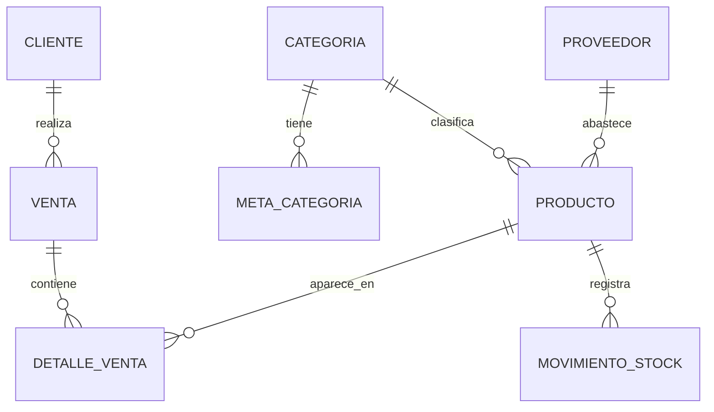
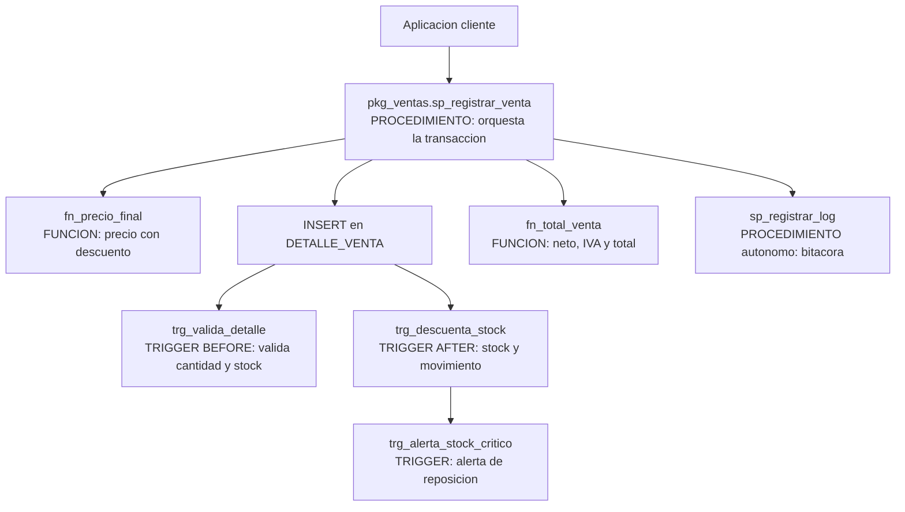

# Evaluación Parcial N° 1 — Caso de Análisis Semestral

**Asignatura:** BDY1103 — Taller de Base de Datos | **Duoc UC**
**Caso:** TecnoParts SpA — Tienda de computadores y componentes
**Equipo:** *(integrante 1)*, *(integrante 2)*, *(integrante 3)* | **Docente:** *(nombre)* | **Fecha:** *(fecha)*

---

## 1. Introducción

### 1.1 Descripción del proyecto

TecnoParts SpA es una tienda de computadores y componentes (CPU, GPU, RAM, almacenamiento, periféricos) con tres sucursales y venta online. Hoy registra ventas y stock en Oracle, pero la lógica de negocio —validar stock, calcular márgenes, aplicar descuentos, alertar reposición y armar reportes— vive en planillas Excel y consultas manuales. Esto produce cifras inconsistentes entre áreas, sobreventa de productos sin stock y un reporte mensual de rentabilidad que demora dos a tres días en armarse.

El objetivo es **centralizar el procesamiento de datos y la generación de información en la base de datos mediante PL/SQL**, para que las reglas se definan una sola vez y estén disponibles para cualquier aplicación cliente. PL/SQL se usa para: bloques anónimos de procesamiento por lotes, tipos compuestos (RECORD y VARRAY) para manejar los resultados en memoria, cursores explícitos parametrizados en loops anidados, control de excepciones, y procedimientos, funciones, packages y triggers para dejar esa lógica residente en la base de datos.

### 1.2 Alcance

Se incluye: gestión de inventario (descuento automático de stock y alertas de reposición), proceso de venta (validación de stock, descuentos por tipo de cliente, cálculo de totales), control de precios (auditoría y bloqueo de precios bajo costo) y reportería de gestión (rentabilidad y cumplimiento de metas por categoría).

Queda fuera: interfaz de usuario, migración de datos históricos, facturación electrónica del SII y pasarelas de pago.

Esta entrega corresponde a la **primera de las tres partes del caso semestral**: modelo de datos, tipos compuestos, bloques anónimos con cursores complejos, control de excepciones y la evaluación de procedimientos, funciones, packages y triggers.

### 1.3 Tecnologías utilizadas

Oracle Database 21c XE, PL/SQL, Oracle SQL Developer 23.x, SQL*Plus, SQL Developer Data Modeler, package nativo `DBMS_OUTPUT` y Git para el versionamiento de los scripts `.sql`.

---

## 2. Datos a procesar e información a generar

### 2.1 Modelo de datos



Tablas: `CATEGORIA`, `PRODUCTO`, `PROVEEDOR`, `CLIENTE`, `SUCURSAL`, `VENTA`, `DETALLE_VENTA`, `MOVIMIENTO_STOCK`, `META_CATEGORIA`, `AUDITORIA_PRECIO`, `ALERTA_STOCK` y `LOG_ERROR` (DDL en el Anexo A).

### 2.2 Datos de entrada

- **Transaccionales:** cabeceras y líneas de venta del período, con cantidad, precio unitario y descuento por línea.
- **Maestros:** productos con costo, precio, stock actual y stock crítico; categorías activas; clientes con su tipo (NORMAL, PREFERENTE, EMPRESA).
- **Paramétricos:** metas de venta por categoría y trimestre; IVA 19%; descuentos por tipo de cliente.
- **Inventario:** movimientos de entrada, salida y ajuste por producto.

### 2.3 Información de salida

1. Reporte de rentabilidad y cumplimiento por categoría: unidades, venta neta, costo, margen %, meta del trimestre y % de cumplimiento.
2. Top 5 de productos por categoría según venta neta.
3. Resumen de entradas y salidas de inventario por producto.
4. Listado de productos en stock crítico para reposición.
5. Bitácora de auditoría de precios y bitácora de errores del procesamiento.

---

## 3. Tipos de datos compuestos (RECORD y VARRAY)

### 3.1 RECORD

Agrupa campos de distinto tipo bajo un solo identificador, como una fila. Se usa para el resumen consolidado por categoría, que **no corresponde a ninguna tabla**: mezcla datos maestros con métricas calculadas.

```sql
TYPE t_resumen_cat IS RECORD (
    id_categoria   categoria.id_categoria%TYPE,
    nombre         categoria.nombre%TYPE,
    unidades       NUMBER := 0,
    venta_neta     NUMBER := 0,
    costo_total    NUMBER := 0,
    margen_pct     NUMBER := 0,
    meta_trimestre NUMBER := 0,
    cumplim_pct    NUMBER := 0
);
v_resumen t_resumen_cat;
```

Los campos que vienen de tablas se declaran con `%TYPE`, de modo que un cambio de tamaño en la columna no obliga a modificar el código. Los campos calculados se inicializan en 0 para no arrastrar `NULL` a las sumas. Para filas que sí corresponden a una tabla se usa `%ROWTYPE`, que es un RECORD implícito.

### 3.2 VARRAY

Colección densa, ordenada y de tamaño máximo fijo, indexada desde 1. Se aplica donde la cardinalidad la define el negocio:

```sql
TYPE t_metas_trim IS VARRAY(4) OF NUMBER;        -- Q1..Q4: siempre son 4
TYPE t_top_sku    IS VARRAY(5) OF VARCHAR2(30);  -- el negocio pidió "top 5"

v_metas t_metas_trim;
v_top   t_top_sku := t_top_sku();                -- inicializado vacío
```

El índice tiene significado propio: `v_metas(3)` es la meta del tercer trimestre, por lo que la meta vigente se obtiene desde la fecha con `TO_NUMBER(TO_CHAR(SYSDATE,'Q'))`.

**Restricción detectada:** un tipo de colección declarado dentro de un bloque PL/SQL no es visible para SQL, así que su constructor no puede usarse en un `SELECT`. La carga se hace en dos pasos: recuperar los valores a variables escalares y luego construir el VARRAY en PL/SQL.

```sql
SELECT meta_q1, meta_q2, meta_q3, meta_q4
  INTO v_q1, v_q2, v_q3, v_q4
  FROM meta_categoria
 WHERE id_categoria = r_cat.id_categoria AND anio = v_anio;

v_metas := t_metas_trim(v_q1, v_q2, v_q3, v_q4);
```

### 3.3 Mejora en la eficiencia

| Aspecto | Sin tipos compuestos | Con RECORD y VARRAY |
|---|---|---|
| Variables por categoría | 8 escalares sueltas | 1 RECORD con 8 campos |
| Consultas para las metas | 4 por categoría | 1 por categoría |
| Cambio de estructura | Todas las firmas y declaraciones | Solo la definición del tipo |
| Cardinalidad | La controla el programador | La impone el límite del VARRAY |

El beneficio principal es la **reducción de cambios de contexto PL/SQL↔SQL**: cargar las cuatro metas en una consulta en lugar de cuatro baja, en una corrida de 12 categorías, de 48 a 12 consultas solo por ese concepto.

---

## 4. Bloques PL/SQL con cursores explícitos complejos

### 4.1 Qué es un cursor explícito y cuándo se usa

Un cursor es un área de trabajo en memoria que apunta al resultado de una consulta. Oracle abre cursores **implícitos** en toda sentencia SQL; el cursor **explícito** es el que el programador declara, abre, lee y cierra.

Se usa cuando la consulta devuelve varias filas que deben procesarse una a una (un `SELECT INTO` con múltiples filas lanza `TOO_MANY_ROWS`), cuando se necesita control del ciclo mediante atributos (`%ROWCOUNT`, `%NOTFOUND`, `%ISOPEN`), cuando hay que recorrer un conjunto dentro de otro, o cuando se quiere reutilizar la misma consulta con distintos filtros.

### 4.2 Cursores simples y complejos

| | Simple | Complejo |
|---|---|---|
| Consulta | Una tabla, sin agregación | JOIN de varias tablas con funciones de grupo |
| Parámetros | No recibe | Recibe y filtra dinámicamente |
| Uso | Recorrido independiente | Anidado dentro de otro cursor |
| En el proyecto | `c_categorias` | `c_productos(p_id_categoria, p_desde, p_hasta)` |

La diferencia de fondo es la **dependencia**: el cursor complejo no puede ejecutarse solo, porque necesita el `id_categoria` que le entrega el cursor externo en cada iteración.

### 4.3 Cursores con parámetros y loops anidados

```sql
CURSOR c_productos (p_id_categoria NUMBER, p_desde DATE, p_hasta DATE) IS
    SELECT p.id_producto, p.sku, p.nombre,
           NVL(SUM(d.cantidad), 0) AS unidades,
           NVL(SUM(d.cantidad * d.precio_unitario
                   * (1 - d.descuento_pct/100)), 0) AS venta_neta,
           NVL(SUM(d.cantidad * p.costo_unitario), 0) AS costo_total
      FROM producto p
      LEFT JOIN detalle_venta d ON d.id_producto = p.id_producto
      LEFT JOIN venta v         ON v.id_venta    = d.id_venta
                               AND v.estado      = 'EMITIDA'
                               AND v.fecha_venta BETWEEN p_desde AND p_hasta
     WHERE p.id_categoria = p_id_categoria AND p.activo = 'S'
     GROUP BY p.id_producto, p.sku, p.nombre, p.costo_unitario
     ORDER BY venta_neta DESC;
```

El `LEFT JOIN` conserva los productos sin ventas con métricas en 0, porque la rotación nula es justamente uno de los datos que la gerencia necesita ver. Los parámetros se declaran **sin precisión** (`NUMBER`, no `NUMBER(8)`), como exige la sintaxis de parámetros formales.

**Utilidad en bucles anidados:** sin parámetros, el cursor interno traería todos los productos de todas las categorías y el código debería descartar los que no corresponden, leyendo N×M filas para usar M. Con parámetros, cada `OPEN` recupera solo el subconjunto necesario y el filtrado lo hace el motor con sus índices.

Estructura implementada (código completo en el Anexo B):

```
FOR r_cat IN c_categorias LOOP                      -- N1: categorías activas
    cargar metas trimestrales en el VARRAY
    FOR r_prod IN c_productos(r_cat.id_categoria,   -- N2: productos de la categoría
                              v_desde, v_hasta) LOOP
        acumular unidades / venta neta / costo en el RECORD
        alimentar el VARRAY del top 5
        FOR r_mov IN c_movimientos(r_prod.id_producto,
                                   v_desde) LOOP    -- N3: movimientos del producto
            clasificar entradas / salidas / ajustes
        END LOOP;
    END LOOP;
    calcular margen y cumplimiento; imprimir resumen
END LOOP;
```

### 4.4 Problemas que resuelven en el proyecto

| Problema del negocio | Solución con cursores complejos |
|---|---|
| Margen calculado con criterios distintos en cada planilla | Una sola fórmula agregada dentro del cursor para todas las categorías |
| Productos sin ventas desaparecían del informe | El `LEFT JOIN` los conserva y hace visible la rotación nula |
| No se sabía si la venta venía de un producto estrella | El cursor viene ordenado por venta neta: el top 5 sale sin segunda consulta |
| Descuadres entre stock y movimientos | `c_movimientos` anidado contrasta entradas y salidas por producto |
| Rearmar el informe para cada período | Los parámetros de fecha permiten reusar el mismo cursor |

### 4.5 Ventajas con volúmenes grandes y múltiples fuentes

- **La agregación ocurre en el motor:** con `SUM` y `GROUP BY` dentro del cursor, PL/SQL recibe una fila por producto y no una por línea de venta. Con 50.000 líneas y 600 productos, el ciclo itera 600 veces en lugar de 50.000.
- **Filtrado en el origen:** los parámetros permiten aprovechar el índice sobre `producto.id_categoria` en vez de descartar filas en memoria.
- **Consolidación de fuentes:** un solo cursor cruza `producto`, `detalle_venta` y `venta`; el cliente no necesita conocer esas relaciones.
- **Memoria acotada:** el cursor entrega las filas de a poco, así el consumo no crece linealmente con el volumen.
- **Procesamiento resiliente:** cada iteración es independiente, así un error en una categoría se registra y el proceso continúa con la siguiente.

**Contrapartida:** cada `FETCH` implica un cambio de contexto PL/SQL↔SQL. Para volúmenes de millones de filas corresponde migrar a `BULK COLLECT ... LIMIT` con `FORALL`.

---

## 5. Integración de control de excepciones

### 5.1 Excepciones predefinidas por Oracle

Tienen nombre y código ya declarados por el motor; se levantan solas y se capturan por su nombre sin declaración previa.

| Excepción | Código | Cuándo ocurre en el proyecto |
|---|---|---|
| `NO_DATA_FOUND` | ORA-01403 | El `SELECT INTO` no encuentra la meta anual de la categoría |
| `TOO_MANY_ROWS` | ORA-01422 | Metas duplicadas por error de carga |
| `ZERO_DIVIDE` | ORA-01476 | Margen con venta neta 0, o cumplimiento con meta 0 |
| `DUP_VAL_ON_INDEX` | ORA-00001 | SKU de producto ya existente |
| `VALUE_ERROR` | ORA-06502 | Valor que excede la precisión de la variable |
| `SUBSCRIPT_BEYOND_COUNT` | ORA-06533 | Acceder a `v_metas(3)` con solo 2 elementos cargados |
| `SUBSCRIPT_OUTSIDE_LIMIT` | ORA-06532 | `EXTEND` más allá del límite del `VARRAY(5)` |

Se usan cuando el error es una **condición técnica que el motor reconoce**.

### 5.2 Excepciones definidas por el usuario

Representan **violaciones de reglas de negocio**: datos que el motor acepta pero la empresa no. Tres mecanismos:

```sql
-- a) Declaración y RAISE explícito (uso interno del bloque)
e_stock_insuficiente EXCEPTION;
...
IF v_stock < p_cantidad THEN RAISE e_stock_insuficiente; END IF;

-- b) RAISE_APPLICATION_ERROR: comunica el error al cliente (-20000 a -20999)
RAISE_APPLICATION_ERROR(-20031,
    'El precio de venta no puede ser inferior al costo.');

-- c) PRAGMA EXCEPTION_INIT: asocia un nombre a un código de error
e_stock_insuficiente EXCEPTION;
PRAGMA EXCEPTION_INIT(e_stock_insuficiente, -20020);
```

**Criterio aplicado:** si el motor puede detectar la condición, se usa la excepción predefinida; si la condición existe solo porque el negocio lo decidió, se define por el usuario.

| Situación | Tipo | Razón |
|---|---|---|
| No existe la fila consultada | Predefinida (`NO_DATA_FOUND`) | Condición técnica del motor |
| Meta anual no cargada | Usuario (`e_meta_no_definida`) | Técnicamente es `NO_DATA_FOUND`, pero el negocio distingue "no hay datos" de "falta un parámetro de gestión" |
| Stock menor al solicitado | Usuario (`-20020`) | El dato es válido; la regla la pone la empresa |
| Precio bajo el costo | Usuario (`-20031`) | Regla comercial pura |
| División por cero en el margen | Predefinida (`ZERO_DIVIDE`) | Error aritmético |

### 5.3 Integración en los bloques del proyecto

Se aplica una estrategia de **tres niveles de alcance**, con el principio de capturar el error lo más abajo posible para que el resto del proceso continúe:

1. **Operación:** bloque anidado mínimo alrededor de una sentencia riesgosa (una división, un `SELECT INTO`). Asigna un valor por defecto y sigue. Es lo que evita que el ciclo se rompa.
2. **Iteración:** bloque anidado por categoría. Registra en `LOG_ERROR`, avisa y pasa a la siguiente con `CONTINUE`.
3. **Bloque:** sección `EXCEPTION` principal con `WHEN OTHERS`, que registra `SQLCODE`, `SQLERRM` y `DBMS_UTILITY.FORMAT_ERROR_BACKTRACE`, hace `ROLLBACK` y termina de forma controlada.

```sql
    FOR r_cat IN c_categorias LOOP
        BEGIN
            ... procesamiento de la categoría ...
        EXCEPTION
            WHEN e_meta_no_definida THEN
                sp_registrar_log('REPORTE', -20050,
                    'Sin meta ' || v_anio || ' en ' || r_cat.nombre);
                CONTINUE;                       -- siguiente categoría
            WHEN TOO_MANY_ROWS THEN
                sp_registrar_log('REPORTE', SQLCODE,
                    'Metas duplicadas en ' || r_cat.nombre);
                CONTINUE;
        END;
    END LOOP;
EXCEPTION
    WHEN OTHERS THEN
        ROLLBACK;
        sp_registrar_log('REPORTE', SQLCODE,
            SQLERRM || ' | ' || DBMS_UTILITY.FORMAT_ERROR_BACKTRACE);
        RAISE;
END;
```

Dos decisiones relevantes: `WHEN OTHERS` **nunca queda vacío**, porque un `WHEN OTHERS THEN NULL` oculta el error y es la causa más común de datos corruptos sin rastro; y `sp_registrar_log` usa `PRAGMA AUTONOMOUS_TRANSACTION` para que su `COMMIT` sobreviva al `ROLLBACK` de la transacción fallida.

### 5.4 Prevención de errores e integridad

| Riesgo | Control | Resultado |
|---|---|---|
| Venta emitida sin stock | `e_stock_insuficiente` antes del `INSERT` | El stock nunca queda negativo |
| Stock descontado y venta no cerrada | `ROLLBACK` en `WHEN OTHERS` | La transacción es atómica |
| Precio bajo costo por error de tipeo | `RAISE_APPLICATION_ERROR(-20031)` en trigger | El `UPDATE` se aborta |
| Reporte abortado por una categoría mal parametrizada | Manejadores por iteración con `CONTINUE` | Se entregan las 11 categorías correctas y queda registrada la que falló |
| División por cero en el margen | `ZERO_DIVIDE` que asigna `NULL` | Se informa "no aplicable" y no 0%, que sería una conclusión falsa |

El punto de fondo: el control de excepciones sirve para **decidir explícitamente qué pasa con la transacción** cuando algo falla. Sin manejadores, el error se propaga dejando la transacción abierta y parcialmente aplicada.

---

## 6. Evaluación de procedimientos, funciones, packages y triggers

### 6.1 Procedimientos almacenados

Subprograma con nombre, compilado y guardado en el diccionario de datos, que ejecuta acciones. Recibe parámetros `IN`, `OUT` e `IN OUT`, no retorna valor con `RETURN` y por eso **no puede invocarse dentro de una sentencia SQL**. Se usa para tareas repetitivas y automatizadas que **modifican el estado** de la base de datos.

| Procedimiento | Responsabilidad |
|---|---|
| `sp_registrar_venta` | Crea la venta, valida stock, inserta detalles y calcula totales |
| `sp_reporte_cumplimiento` | Genera el reporte por categoría con los cursores anidados |
| `sp_generar_alertas_stock` | Inserta alertas de los productos bajo stock crítico |
| `sp_registrar_log` | Bitácora de errores en transacción autónoma |

### 6.2 Funciones almacenadas

Subprograma que **obligatoriamente retorna un valor**. Su propósito es calcular, no modificar; si no contiene DML puede invocarse dentro de `SELECT`, `WHERE` u `ORDER BY`.

| Función | Retorno | Uso |
|---|---|---|
| `fn_margen_pct(id_producto)` | `NUMBER` | Margen porcentual del producto |
| `fn_precio_final(id_producto, tipo_cliente)` | `NUMBER` | Precio con descuento según tipo de cliente |
| `fn_total_venta(id_venta)` | `NUMBER` | Total de la venta con IVA |

```sql
SELECT sku, nombre, fn_margen_pct(id_producto) AS margen
  FROM producto
 WHERE fn_margen_pct(id_producto) < 10;
```

Esto elimina el problema original del negocio: **la fórmula del margen existe en un solo lugar y todos la invocan**.

### 6.3 Packages

Unidad que agrupa procedimientos, funciones, tipos, constantes y excepciones relacionadas. Tiene **especificación** (la interfaz pública: qué existe y con qué firma) y **cuerpo** (la implementación; todo lo declarado solo ahí es privado).

| Package | Contenido |
|---|---|
| `pkg_ventas` | IVA, tipo `t_resumen_cat`, excepciones de negocio, registro y cierre de venta, cálculo de totales, reporte |
| `pkg_inventario` | Alertas de stock, disponibilidad, ajustes y movimientos |
| `pkg_utilidades` | `sp_registrar_log`, formateo de montos |

Aportes de la modularización:

- **Encapsulamiento real:** la fórmula de descuento por tipo de cliente es privada del cuerpo; solo se accede vía `fn_precio_final`.
- **Gestión de dependencias:** si cambia el cuerpo sin tocar la especificación, los objetos dependientes **no se invalidan** ni requieren recompilación.
- **Estado por sesión:** las variables de la especificación conservan su valor durante la sesión, lo que permite cachear parámetros.
- **Sobrecarga:** dos funciones con el mismo nombre y distinta firma, imposible entre procedimientos sueltos.

### 6.4 Triggers

Bloque PL/SQL que el motor ejecuta **automáticamente** ante un evento (`INSERT`, `UPDATE`, `DELETE`). No se invoca: se dispara. Se clasifica por momento (`BEFORE`/`AFTER`) y granularidad (`FOR EACH ROW` o de sentencia).

| Trigger | Evento | Función |
|---|---|---|
| `trg_audita_precio` | `BEFORE UPDATE OF precio_venta ON producto` | Valida precio sobre costo y registra el cambio en auditoría |
| `trg_valida_detalle` | `BEFORE INSERT ON detalle_venta` | Rechaza cantidades ≤ 0 y stock insuficiente |
| `trg_descuenta_stock` | `AFTER INSERT ON detalle_venta` | Descuenta stock y registra el movimiento |
| `trg_alerta_stock_critico` | `AFTER UPDATE OF stock_actual ON producto` | Genera la alerta de reposición |

Automatizan auditoría e integridad porque **ninguna ruta de acceso puede saltárselos**: el registro ocurre igual si el cambio viene de la aplicación web, de SQL Developer o de un script manual. Además permiten reglas que una constraint `CHECK` no puede expresar, como comparar el precio contra el costo del mismo producto o contra el stock de otra tabla.

### 6.5 Estrategia de implementación e interacción



Flujo de una venta: la aplicación invoca `sp_registrar_venta` —único punto de entrada, sin `INSERT` directo sobre las tablas—; el procedimiento consulta `fn_precio_final` para el precio con descuento; al insertar cada línea, `trg_valida_detalle` rechaza lo inválido y `trg_descuenta_stock` actualiza el inventario, lo que a su vez dispara la alerta de stock crítico; finalmente `fn_total_venta` calcula los totales y el procedimiento cierra la venta. Si algo falla, el manejador hace `ROLLBACK` y registra el error en transacción autónoma.

La división de responsabilidades: los **procedimientos orquestan y modifican**, las **funciones calculan y se reutilizan**, los **packages agrupan y encapsulan**, y los **triggers garantizan lo que no debe depender de que alguien lo recuerde**.

**Reutilización y mantenimiento:** si el IVA cambia, se modifica una constante del package en lugar de buscar el número `0.19` repartido en la aplicación, los reportes y las planillas. La regla es la misma para la web, un batch nocturno o una consulta manual. Además el código se compila contra el diccionario de datos, así que eliminar una columna invalida los objetos dependientes de inmediato en vez de fallar en producción.

### 6.6 Problemas y limitaciones

**Rendimiento.** El recorrido fila por fila implica un cambio de contexto por cada `FETCH`; para millones de filas se requiere `BULK COLLECT` con `FORALL`. Una función dentro de un `SELECT` sobre 600.000 filas se ejecuta 600.000 veces, por lo que conviene declararla `DETERMINISTIC` o resolver el cálculo en SQL puro. Los triggers `FOR EACH ROW` se ejecutan una vez por fila: una carga masiva de 50.000 líneas dispara 50.000 ejecuciones.

**Mantenimiento.** El trigger es el objeto más riesgoso porque **no aparece en el código que lo provoca**: quien lea `sp_registrar_venta` no verá que el stock se descuenta. Se mitiga documentándolos y manteniéndolos cortos. También hay encadenamiento de triggers (el de stock dispara el de alerta), limitado a un nivel, y la restricción de **tabla mutante (ORA-04091)**, que impide que un trigger de fila sobre `detalle_venta` consulte esa misma tabla; la validación se movió al procedimiento y, de necesitarse, se usaría un `COMPOUND TRIGGER`.

**Seguridad.** Los subprogramas se ejecutan por defecto con derechos del definidor (`AUTHID DEFINER`), lo que es útil para restringir el acceso directo a tablas pero convierte un procedimiento mal diseñado en una escalada de privilegios. Se evita el SQL dinámico por riesgo de inyección; donde sea inevitable se usarán bind variables. Los mensajes de `RAISE_APPLICATION_ERROR` no deben exponer nombres de tablas ni datos de otros clientes.

---

## 7. Conclusión

**Resumen.** Se planteó centralizar la lógica de negocio de TecnoParts SpA en Oracle mediante PL/SQL sobre un modelo de doce tablas. Se definió un RECORD para el resumen consolidado por categoría —que no existe como fila de ninguna tabla— y dos VARRAY de tamaño fijo para metas trimestrales y top 5, donde el límite expresa una regla de negocio. Se desarrollaron cursores explícitos, uno sin parámetros y dos parametrizados, recorridos en tres niveles de loops anidados. Se integró control de excepciones en tres niveles de alcance, usando excepciones predefinidas para condiciones técnicas y definidas por el usuario para reglas de negocio. Finalmente se evaluó la implementación de procedimientos, funciones, packages y triggers con una asignación explícita de responsabilidades y sus limitaciones.

**Impacto del proyecto.**

| Situación actual | Con la solución PL/SQL |
|---|---|
| Reporte de rentabilidad armado a mano en 2-3 días | Un procedimiento ejecutado en segundos |
| Fórmula de margen distinta en cada planilla | Una única función invocable desde SQL y PL/SQL |
| Sobreventa por olvido de revisar stock | Validación en trigger, imposible de omitir |
| Cambios de precio sin registro | Auditoría automática con usuario y fecha |
| Reposición reactiva, al detectar el quiebre | Alertas automáticas al cruzar el stock crítico |

**Recomendaciones.** Migrar a `BULK COLLECT ... LIMIT` con `FORALL` cuando el volumen de detalle crezca; usar arreglos asociativos donde la cardinalidad sea desconocida; declarar funciones `DETERMINISTIC` y evaluar `RESULT_CACHE`; reemplazar `DBMS_OUTPUT` por una tabla de resultados o un `SYS_REFCURSOR` para que cualquier herramienta consuma el reporte; automatizar las alertas y el cierre mensual con `DBMS_SCHEDULER`; incorporar pruebas unitarias con utPLSQL, sobre todo en los caminos de excepción; y extender PL/SQL a comisiones de vendedores, garantías/RMA y proyección de demanda por categoría.

---

## Anexo A — DDL principal (extracto)

```sql
CREATE TABLE categoria (
    id_categoria NUMBER(4) PRIMARY KEY,
    nombre       VARCHAR2(50) NOT NULL UNIQUE,
    activo       CHAR(1) DEFAULT 'S' CHECK (activo IN ('S','N'))
);

CREATE TABLE producto (
    id_producto    NUMBER(8) PRIMARY KEY,
    sku            VARCHAR2(30) NOT NULL UNIQUE,
    nombre         VARCHAR2(120) NOT NULL,
    id_categoria   NUMBER(4) NOT NULL REFERENCES categoria(id_categoria),
    id_proveedor   NUMBER(5) NOT NULL REFERENCES proveedor(id_proveedor),
    costo_unitario NUMBER(12,2) NOT NULL CHECK (costo_unitario >= 0),
    precio_venta   NUMBER(12,2) NOT NULL CHECK (precio_venta  >= 0),
    stock_actual   NUMBER(8) DEFAULT 0 CHECK (stock_actual >= 0),
    stock_critico  NUMBER(8) DEFAULT 5,
    activo         CHAR(1) DEFAULT 'S'
);

CREATE TABLE venta (
    id_venta    NUMBER(10) PRIMARY KEY,
    id_cliente  NUMBER(8) NOT NULL REFERENCES cliente(id_cliente),
    id_sucursal NUMBER(3) NOT NULL REFERENCES sucursal(id_sucursal),
    fecha_venta DATE DEFAULT SYSDATE NOT NULL,
    total_neto  NUMBER(14,2) DEFAULT 0,
    total_iva   NUMBER(14,2) DEFAULT 0,
    total_bruto NUMBER(14,2) DEFAULT 0,
    estado      VARCHAR2(10) DEFAULT 'BORRADOR'
                CHECK (estado IN ('BORRADOR','EMITIDA','ANULADA'))
);

CREATE TABLE detalle_venta (
    id_venta        NUMBER(10) NOT NULL REFERENCES venta(id_venta),
    nro_linea       NUMBER(4)  NOT NULL,
    id_producto     NUMBER(8)  NOT NULL REFERENCES producto(id_producto),
    cantidad        NUMBER(6)  NOT NULL CHECK (cantidad > 0),
    precio_unitario NUMBER(12,2) NOT NULL,
    descuento_pct   NUMBER(5,2) DEFAULT 0 CHECK (descuento_pct BETWEEN 0 AND 100),
    CONSTRAINT pk_detalle PRIMARY KEY (id_venta, nro_linea)
);

CREATE TABLE meta_categoria (
    id_categoria NUMBER(4) NOT NULL REFERENCES categoria(id_categoria),
    anio         NUMBER(4) NOT NULL,
    meta_q1 NUMBER(14,2) DEFAULT 0, meta_q2 NUMBER(14,2) DEFAULT 0,
    meta_q3 NUMBER(14,2) DEFAULT 0, meta_q4 NUMBER(14,2) DEFAULT 0,
    CONSTRAINT pk_meta_cat PRIMARY KEY (id_categoria, anio)
);

-- movimiento_stock, auditoria_precio, alerta_stock, log_error,
-- secuencias seq_venta / seq_movimiento / seq_auditoria / seq_alerta / seq_log
-- e índices sobre producto(id_categoria), detalle_venta(id_producto)
-- y venta(fecha_venta, estado) en el script completo.
```

## Anexo B — Bloque anónimo: reporte de cumplimiento por categoría

```sql
SET SERVEROUTPUT ON SIZE UNLIMITED;
DECLARE
    TYPE t_metas_trim IS VARRAY(4) OF NUMBER;
    TYPE t_top_sku    IS VARRAY(5) OF VARCHAR2(30);

    TYPE t_resumen_cat IS RECORD (
        id_categoria   categoria.id_categoria%TYPE,
        nombre         categoria.nombre%TYPE,
        unidades       NUMBER := 0,
        venta_neta     NUMBER := 0,
        costo_total    NUMBER := 0,
        margen_pct     NUMBER := 0,
        meta_trimestre NUMBER := 0,
        cumplim_pct    NUMBER := 0
    );

    v_resumen   t_resumen_cat;
    v_metas     t_metas_trim;
    v_top       t_top_sku := t_top_sku();
    v_anio      NUMBER := TO_NUMBER(TO_CHAR(SYSDATE,'YYYY'));
    v_trimestre NUMBER := TO_NUMBER(TO_CHAR(SYSDATE,'Q'));
    v_desde     DATE   := TRUNC(SYSDATE,'Q');
    v_hasta     DATE   := SYSDATE;
    v_q1 NUMBER; v_q2 NUMBER; v_q3 NUMBER; v_q4 NUMBER;
    v_entradas  NUMBER;
    v_salidas   NUMBER;

    e_meta_no_definida EXCEPTION;
    e_meta_en_cero     EXCEPTION;

    CURSOR c_categorias IS
        SELECT id_categoria, nombre FROM categoria
         WHERE activo = 'S' ORDER BY nombre;

    CURSOR c_productos (p_id_categoria NUMBER, p_desde DATE, p_hasta DATE) IS
        SELECT p.id_producto, p.sku, p.nombre,
               NVL(SUM(d.cantidad),0) AS unidades,
               NVL(SUM(d.cantidad * d.precio_unitario
                       * (1 - d.descuento_pct/100)),0) AS venta_neta,
               NVL(SUM(d.cantidad * p.costo_unitario),0) AS costo_total
          FROM producto p
          LEFT JOIN detalle_venta d ON d.id_producto = p.id_producto
          LEFT JOIN venta v         ON v.id_venta    = d.id_venta
                                   AND v.estado      = 'EMITIDA'
                                   AND v.fecha_venta BETWEEN p_desde AND p_hasta
         WHERE p.id_categoria = p_id_categoria AND p.activo = 'S'
         GROUP BY p.id_producto, p.sku, p.nombre, p.costo_unitario
         ORDER BY venta_neta DESC;

    CURSOR c_movimientos (p_id_producto NUMBER, p_desde DATE) IS
        SELECT tipo_movimiento, SUM(cantidad) AS total
          FROM movimiento_stock
         WHERE id_producto = p_id_producto AND fecha >= p_desde
         GROUP BY tipo_movimiento;
BEGIN
    DBMS_OUTPUT.PUT_LINE('CUMPLIMIENTO Y RENTABILIDAD - Q' || v_trimestre ||
                         ' ' || v_anio);

    FOR r_cat IN c_categorias LOOP                      -- NIVEL 1
        BEGIN
            v_resumen.id_categoria := r_cat.id_categoria;
            v_resumen.nombre       := r_cat.nombre;
            v_resumen.unidades     := 0;
            v_resumen.venta_neta   := 0;
            v_resumen.costo_total  := 0;
            v_top                  := t_top_sku();

            BEGIN
                SELECT meta_q1, meta_q2, meta_q3, meta_q4
                  INTO v_q1, v_q2, v_q3, v_q4
                  FROM meta_categoria
                 WHERE id_categoria = r_cat.id_categoria AND anio = v_anio;
            EXCEPTION
                WHEN NO_DATA_FOUND THEN RAISE e_meta_no_definida;
            END;

            v_metas := t_metas_trim(v_q1, v_q2, v_q3, v_q4);

            IF v_trimestre > v_metas.COUNT THEN
                RAISE SUBSCRIPT_BEYOND_COUNT;
            END IF;

            v_resumen.meta_trimestre := NVL(v_metas(v_trimestre), 0);
            IF v_resumen.meta_trimestre = 0 THEN RAISE e_meta_en_cero; END IF;

            DBMS_OUTPUT.PUT_LINE(CHR(10) || '>> ' || r_cat.nombre ||
                '  (meta Q' || v_trimestre || ': ' ||
                TO_CHAR(v_resumen.meta_trimestre,'999G999G999') || ')');

            FOR r_prod IN c_productos(r_cat.id_categoria,                -- NIVEL 2
                                      v_desde, v_hasta) LOOP
                v_resumen.unidades    := v_resumen.unidades    + r_prod.unidades;
                v_resumen.venta_neta  := v_resumen.venta_neta  + r_prod.venta_neta;
                v_resumen.costo_total := v_resumen.costo_total + r_prod.costo_total;

                IF r_prod.unidades > 0 AND v_top.COUNT < v_top.LIMIT THEN
                    v_top.EXTEND;
                    v_top(v_top.COUNT) := r_prod.sku;
                END IF;

                v_entradas := 0; v_salidas := 0;
                FOR r_mov IN c_movimientos(r_prod.id_producto,           -- NIVEL 3
                                           v_desde) LOOP
                    CASE r_mov.tipo_movimiento
                        WHEN 'ENTRADA' THEN v_entradas := v_entradas + r_mov.total;
                        WHEN 'SALIDA'  THEN v_salidas  := v_salidas  + r_mov.total;
                        ELSE NULL;
                    END CASE;
                END LOOP;

                DBMS_OUTPUT.PUT_LINE('   ' || RPAD(r_prod.sku,14) ||
                    RPAD(SUBSTR(r_prod.nombre,1,26),28) ||
                    LPAD(r_prod.unidades,6) ||
                    LPAD(TO_CHAR(r_prod.venta_neta,'999G999G999'),14) ||
                    '  E:' || v_entradas || ' S:' || v_salidas);
            END LOOP;

            BEGIN
                v_resumen.margen_pct :=
                    ROUND((v_resumen.venta_neta - v_resumen.costo_total)
                          / v_resumen.venta_neta * 100, 2);
            EXCEPTION
                WHEN ZERO_DIVIDE THEN v_resumen.margen_pct := NULL;
            END;

            v_resumen.cumplim_pct := ROUND(v_resumen.venta_neta
                                           / v_resumen.meta_trimestre * 100, 2);

            DBMS_OUTPUT.PUT_LINE('   TOTAL: unid=' || v_resumen.unidades ||
                ' neto=' || TO_CHAR(v_resumen.venta_neta,'999G999G999') ||
                ' margen=' || NVL(TO_CHAR(v_resumen.margen_pct),'N/A') || '%' ||
                ' cumplimiento=' || v_resumen.cumplim_pct || '%');

            IF v_resumen.cumplim_pct < 60 THEN
                DBMS_OUTPUT.PUT_LINE('   [ALERTA] Bajo el 60% de la meta.');
            END IF;

        EXCEPTION
            WHEN e_meta_no_definida THEN
                DBMS_OUTPUT.PUT_LINE('>> ' || r_cat.nombre ||
                    ': sin meta ' || v_anio || '. Categoria omitida.');
            WHEN e_meta_en_cero THEN
                DBMS_OUTPUT.PUT_LINE('>> ' || r_cat.nombre ||
                    ': meta del trimestre en 0.');
            WHEN TOO_MANY_ROWS THEN
                DBMS_OUTPUT.PUT_LINE('>> ' || r_cat.nombre ||
                    ': metas duplicadas. Revisar META_CATEGORIA.');
            WHEN SUBSCRIPT_BEYOND_COUNT THEN
                DBMS_OUTPUT.PUT_LINE('>> ' || r_cat.nombre ||
                    ': VARRAY de metas incompleto.');
        END;
    END LOOP;
EXCEPTION
    WHEN OTHERS THEN
        DBMS_OUTPUT.PUT_LINE('ERROR [' || SQLCODE || ']: ' || SQLERRM);
        DBMS_OUTPUT.PUT_LINE(DBMS_UTILITY.FORMAT_ERROR_BACKTRACE);
END;
/
```

## Anexo C — Objetos almacenados (extracto)

```sql
-- FUNCION
CREATE OR REPLACE FUNCTION fn_margen_pct (p_id_producto IN NUMBER)
RETURN NUMBER DETERMINISTIC IS
    v_precio producto.precio_venta%TYPE;
    v_costo  producto.costo_unitario%TYPE;
BEGIN
    SELECT precio_venta, costo_unitario INTO v_precio, v_costo
      FROM producto WHERE id_producto = p_id_producto;

    IF NVL(v_precio,0) = 0 THEN RETURN NULL; END IF;
    RETURN ROUND((v_precio - v_costo) / v_precio * 100, 2);
EXCEPTION
    WHEN NO_DATA_FOUND THEN
        RAISE_APPLICATION_ERROR(-20010,
            'El producto ' || p_id_producto || ' no existe.');
END fn_margen_pct;
/

-- PACKAGE (especificación)
CREATE OR REPLACE PACKAGE pkg_ventas AS
    c_iva CONSTANT NUMBER := 0.19;

    e_stock_insuficiente EXCEPTION;
    PRAGMA EXCEPTION_INIT(e_stock_insuficiente, -20020);

    PROCEDURE sp_registrar_venta (p_id_cliente  IN  NUMBER,
                                  p_id_sucursal IN  NUMBER,
                                  p_id_venta    OUT NUMBER);
    PROCEDURE sp_agregar_linea   (p_id_venta    IN NUMBER,
                                  p_id_producto IN NUMBER,
                                  p_cantidad    IN NUMBER);
    PROCEDURE sp_cerrar_venta    (p_id_venta IN NUMBER);
    FUNCTION  fn_total_venta     (p_id_venta IN NUMBER) RETURN NUMBER;
END pkg_ventas;
/

-- PACKAGE (cuerpo, extracto)
CREATE OR REPLACE PACKAGE BODY pkg_ventas AS

    FUNCTION fn_dcto_por_tipo (p_tipo IN VARCHAR2)   -- PRIVADA
    RETURN NUMBER IS
    BEGIN
        RETURN CASE p_tipo WHEN 'PREFERENTE' THEN 5
                           WHEN 'EMPRESA'    THEN 12
                           ELSE 0 END;
    END fn_dcto_por_tipo;

    FUNCTION fn_total_venta (p_id_venta IN NUMBER) RETURN NUMBER IS
        v_neto NUMBER := 0;
    BEGIN
        SELECT NVL(SUM(cantidad * precio_unitario * (1 - descuento_pct/100)),0)
          INTO v_neto FROM detalle_venta WHERE id_venta = p_id_venta;
        RETURN ROUND(v_neto * (1 + c_iva));
    END fn_total_venta;

    PROCEDURE sp_cerrar_venta (p_id_venta IN NUMBER) IS
        v_lineas NUMBER;
        v_neto   NUMBER;
    BEGIN
        SELECT COUNT(*) INTO v_lineas
          FROM detalle_venta WHERE id_venta = p_id_venta;

        IF v_lineas = 0 THEN
            RAISE_APPLICATION_ERROR(-20021,
                'No se puede emitir una venta sin lineas de detalle.');
        END IF;

        SELECT NVL(SUM(cantidad * precio_unitario * (1 - descuento_pct/100)),0)
          INTO v_neto FROM detalle_venta WHERE id_venta = p_id_venta;

        UPDATE venta
           SET total_neto  = ROUND(v_neto),
               total_iva   = ROUND(v_neto * c_iva),
               total_bruto = ROUND(v_neto * (1 + c_iva)),
               estado      = 'EMITIDA'
         WHERE id_venta = p_id_venta;
        COMMIT;
    EXCEPTION
        WHEN OTHERS THEN
            ROLLBACK;
            sp_registrar_log('pkg_ventas.sp_cerrar_venta', SQLCODE, SQLERRM);
            RAISE;
    END sp_cerrar_venta;

    -- sp_registrar_venta y sp_agregar_linea en el script completo
END pkg_ventas;
/

-- TRIGGERS
CREATE OR REPLACE TRIGGER trg_audita_precio
BEFORE UPDATE OF precio_venta ON producto
FOR EACH ROW
WHEN (NVL(OLD.precio_venta,-1) <> NVL(NEW.precio_venta,-1))
BEGIN
    IF :NEW.precio_venta < :NEW.costo_unitario THEN
        RAISE_APPLICATION_ERROR(-20031,
            'El precio de venta no puede ser inferior al costo.');
    END IF;

    INSERT INTO auditoria_precio (id_auditoria, id_producto,
                                  precio_anterior, precio_nuevo, usuario_bd)
    VALUES (seq_auditoria.NEXTVAL, :OLD.id_producto,
            :OLD.precio_venta, :NEW.precio_venta, USER);
END trg_audita_precio;
/

CREATE OR REPLACE TRIGGER trg_descuenta_stock
AFTER INSERT ON detalle_venta
FOR EACH ROW
BEGIN
    UPDATE producto SET stock_actual = stock_actual - :NEW.cantidad
     WHERE id_producto = :NEW.id_producto;

    INSERT INTO movimiento_stock (id_movimiento, id_producto, tipo_movimiento,
                                  cantidad, id_venta)
    VALUES (seq_movimiento.NEXTVAL, :NEW.id_producto, 'SALIDA',
            :NEW.cantidad, :NEW.id_venta);
END trg_descuenta_stock;
/
```

## Anexo D — Diagramas

Modelo entidad-relación (punto 2.1), flujo de la venta y objetos que intervienen (punto 6.5), y estructura de los loops anidados (punto 4.3).

---

*Fin del informe.*
